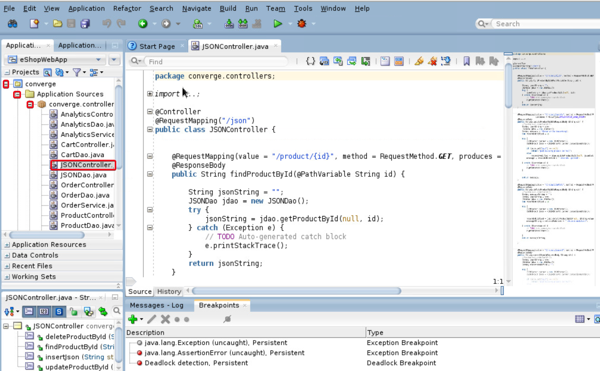
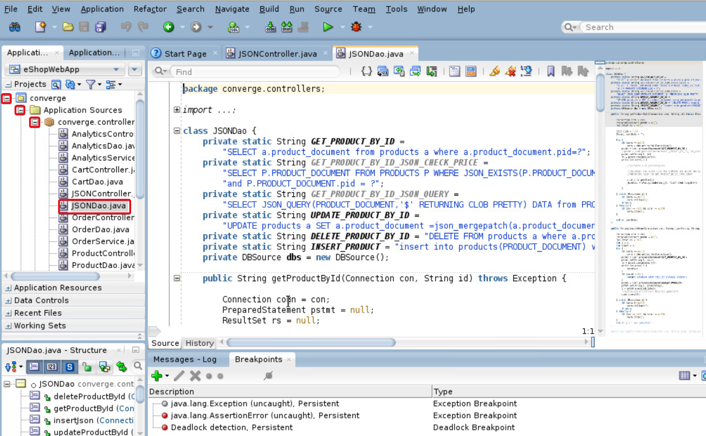
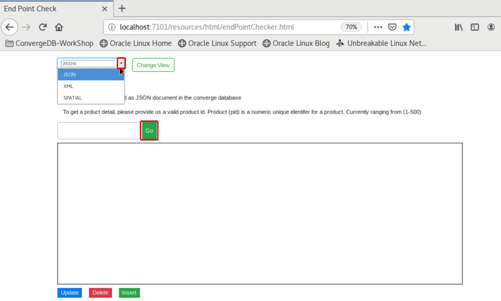

# Data Type Demonstartion Tool 

## Introduction

 In this lab we will launch an application(Datatype Demonstration tool) which will be used to do CRUD operations on different datatypes like JSON, XML and SPATIAL stored in the converged database. 

*Estimated Time*: 10 Minutes

### Prerequisites

- Lab 1: Generate SSH Key - Cloud Shell
- Lab 2: Setup Compute Instance
- Lab 3: Start Services
- Lab 4: Deploy eSHOP Application

### About Datatype Demonstration tool
 The UI tool is built using AJAX and HTML. This tool has been already deployed as part of eSHOP application.

## Step 1:  Access data type code 

  The logic for creating REST end points to access data from converged database is written under controllers   as xxxController.java.  All the java class files collecting such data are named as xxxDao.java files.

1. In the JDeveloper under Projects Navigation Pane, under Click on **+** sign against **converge**, Expand **Application Sources**, expand **converge.controllers**
2. Double click on **JSONController.java** to open it in JDeveloper
3. Check all the @RequestMapping annotations.  You will find the request method and data type consumed for each method. 

  

4. Note that the code has functions to hold logic for presenting, updating, inserting and deleting JSON datatype
5. Double click on JSONDao.java to open it in JDeveloper

  
6. Observe the SQL queries written to do database operations
7. In the declaration section at top of the file (around line 16) check the GET\_PRODUCT\_BY_ID string and the sql select statement.
8. Also check the getProductById(Connection con,  String id) function consuming the SQL select query and the result set is retrieved as a CLOB
9. Also check that the statement 

    ````
    <copy>
    conn = dbs.getJsonXmlConnection();
    </copy>
    ````

  makes us understand that the method in **DBSource.java** under converge.dbHelpers  to get database connection is using the be **datasource_jsonXml** bean name declared in **applicationContext.xml**  under **Resources** which is in turn pointing to **converge.oracle.jsonxml** datasource to fetch you the records, pointing to database apppdb (PDB).

10. Similarly, there are controller and DAO files for different datatypes like XML, SPATIAL and Analytics.  Open the code and verify the flow if interested.

## Step 2: Access the tool code

 The datatype access and testing utility **endPointChecker** is pre-installed as part of the eSHOP application for workshop convenience.

 The tool will be useful to do all the Create, Retrieve, Update and Delete operations on the different datatypes.

 The HTML uses AJAX and Java Script technology to make calls to the business logic.  

1. Open JDeveloper in **Studio** mode.
2. Under **Projects**  expand **Converge**
3. Navigate to **Web Content** and expand it
4. Expand **resourcesOpen** folder html to see the UI tool
5. Double click on **endPointChecker.html** 
 (Optional)Note: Accept and Proceed certificates if prompted
6. Click on **Source** to view code (Optional)

## Step 3: Launch the demonstrator tool

1. Open the Firefox browser and navigate to http://localhost:7101/resources/html/endPointChecker.html. OR You can use the bookmark **DataType-End Point Check Utility** under **ConvergedDB-Workshop** in Bookmark Toolbar
2. Click on the drop-down to see the list of datatypes shown in workshop
3. Select a datatype and click on **Change View** button to change 

  

***Note:*** Certain Datatype's fetch requests may not give results instantaneosly. In certain cases we have to insert data before accessing it. 

## Acknowledgements
- **Authors** - Pradeep Chandramouli, Nishant Kaushik
- **Contributors** - Kanika Sharma, Laxmi Amarappanavar, Balasubramanian Ramamoorthy
- **Team** - North America Database and AppDev Specialists
- **Last Updated By** - Kanika Sharma, Solution Engineer, Oracle Database, October 2020

## See an issue?
Please submit feedback using this [form](https://apexapps.oracle.com/pls/apex/f?p=133:1:::::P1_FEEDBACK:1). Please include the *workshop name*, *lab* and *step* in your request.  If you don't see the workshop name listed, please enter it manually. If you would like us to follow up with you, enter your email in the *Feedback Comments* section.

      