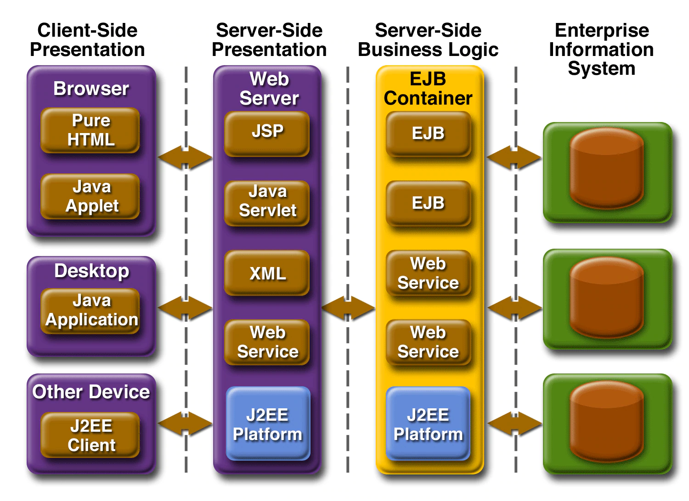
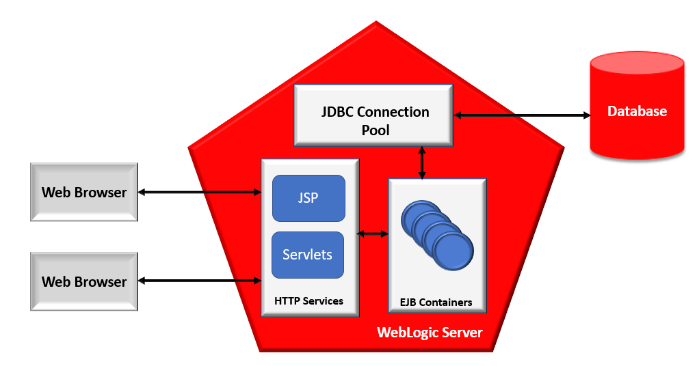
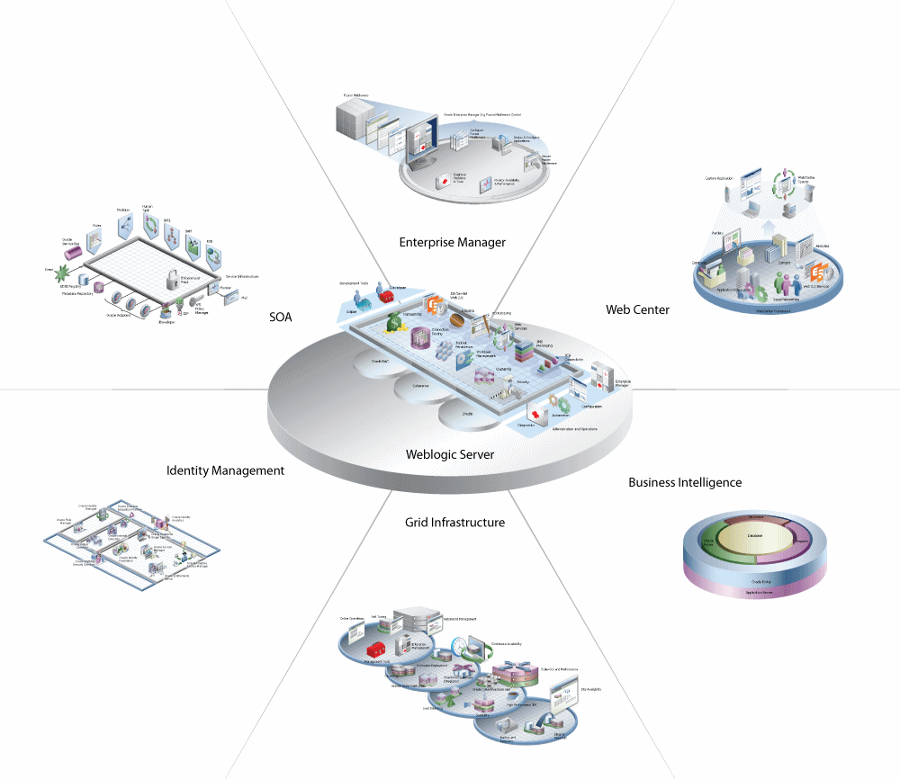

# Introduction

## About Java EE ##

Java Platform, Enterprise Edition (Java EE) is the standard in community-driven enterprise software. Java EE is developed using the Java Community Process, with contributions from industry experts, commercial and open source organizations, Java User Groups, and countless individuals. Each release integrates new features that align with industry needs, improves application portability, and increases developer productivity.

The Java EE platform is designed to help developers create large-scale, multitiered, scalable, reliable, and secure network applications. A shorthand name for such applications is enterprise applications, so called because these applications are designed to solve the problems encountered by large enterprises.The benefits of an enterprise application are helpful, even essential, for individual developers and small organizations in an increasingly networked world.

The features that make enterprise applications powerful, like security and reliability, often make these applications complex. The Java EE platform reduces the complexity of enterprise application development by providing a development model, API, and runtime environment that allow developers to concentrate on functionality.

The Enterprise Application Model

A Java EE server is a server application that implements the Java EE platform APIs and provides standard Java EE services. Java EE servers are sometimes called application servers, because they 
allow you to serve application data to clients, much as web servers serve web pages to web browsers.

Java EE servers host several application component types that correspond to the tiers in a multitiered application. The Java EE server provides services to these components in the form of a container.

Java EE containers are the interface between the component and the lower-level functionality provided by the platform to support that component. The functionality of the container is defined by the platform and is different for each component type. Nonetheless, the server allows the different component types to work together to provide functionality in an enterprise application.

## About Oracle WebLogic Server

Oracle WebLogic Server is a scalable, enterprise-ready Java Platform, Enterprise Edition (Java EE) application server. The WebLogic Server infrastructure supports the deployment of many types of distributed applications and is an ideal foundation for building applications based on Service Oriented Architectures (SOA). 

The WebLogic Server complete implementation of the Java EE 6.0 specification provides a standard set of APIs for creating distributed Java applications that can access a wide variety of services, such as databases, messaging services, and connections to external enterprise systems. End-user clients access these applications using Web browser clients or Java clients. It also supports the Spring Framework, a programming model for Java applications which provides an alternative to aspects of the Java EE model.

In addition to the Java EE implementation, WebLogic Server enables enterprises to deploy mission-critical applications in a robust, secure, highly available, and scalable environment. These features allow enterprises to configure clusters of WebLogic Server instances to distribute load, and provide extra capacity in case of hardware or other failures.

WebLogic Server with same features of on-premise installation is also available on Oracle Cloud Infrastructure, as an option to be deployed on Azure IaaS, as Docker Images and also as WebLogic Operator for deployment on Kubernetes Clusters to help application modernization and support lightweight and largely scalable deployment options.

### Objectives

In this workshop, you'll gain first-hand experience of using data types beyond relational data - JSON, XML, Spatial and Graph.

You will walk through the different components of a JEE application, know how to use datasource in WebLogic, deploy an application from JDeveloper on to a linked WebLogic Server.  

You will also see how to create REST endpoints to present data over HTTP/HTTPS in JSON format and also see CRUD operations on different data types.

You will get experience of using ORDS end-point in Java Code and also see JDeveloper’s potential to be used as an IDE to connect to database and also develop JEE applications.

Once you complete your setup, the next labs in this workshop cover these individual data types, and the final lab consists of ORDS examples:

- Lab 4: eSHOP Application

- Lab 5: Data Type Demonstration Tool

- Lab6: JSON 

- Lab 7: XML

- Lab 8: SPATIAL

- Lab 9: Cross Data Type

- Lab 10: ORDS as Microservice

You will also download VNC Client, setup SSH tunnelling to consume the JDeveloper installed on the workshop instance.

### Prerequisites

- VNC Client, PuTTY tool 
- An Oracle Cloud account, Free Trial, LiveLabs or a Paid account

Estimated Workshop Time: 4.5 hours

## About Use Case

The eSHOP company has a shopping cart web application to sell all clothing and fashion accessories to its customers.  The product details are all provided in JSON format by different vendors of the product and the customers shopping data is retained as XML as per the current single database used for the shopping application.  The store location details are stored as spatial data in a separate single purpose database and all analytical data for the application is residing in a different single purpose database.  In total., the application must deal with multiple datatypes. Hence, the eSHOP company earlier had overhead of connecting to different single-purpose databases to work on each datatype for its shopping cart web application.

The connections to databases and transactions involved with database is always costly and complex.  Because of these multiple single purpose databases, the eShop company had to have engineers knowing to handle these specific single purpose databases, bear the integration costs and complexities of handling the application code which talks to these different databases.  Scalability is another challenge the eSHOP company is facing due to the data fragmentation in the old architecture involving these multiple single-purpose databases.

The CTO of the company decides to re-write the e-shopping  web application using J2EE standards to host on WebLogic., the market leader for enterprise application services. Java developers at eSHOP can leverage the Oracle’s best JEE development tool JDeveloper for coding this new application. 

Oracle has Converged database to offer which supports all these and many more datatypes in one single database. The developers in eSHOP company now enjoy the freedom to connect to a single converged oracle database to handle JSON, XML, Spatial and Graph data for its application.  This doesn’t need the developers know how to deal with different data-type specific databases and the integration complexities beneath.

The data fragmentation across different databases is avoided with converged database in action. The overhead of security and integration cost is avoided. By eliminating data fragmentation, eSHOP can eliminate copy contagion. Application modules or services automatically use a single copy of shared data in a converged database. There are no errors or time delays due to data propagated. The power new generation oracle database and application server features like scaling, high-availability and DR options can all be seamlessly leveraged now.

Oracle Database is an excellent example of a converged database, as it provides support for Machine Learning, Blockchain, Graph, Spatial, JSON, REST, Events, Editions, and IoT Streaming as part of the core database at no additional cost. It allows you to support many diverse projects using a single platform, significantly reducing complexity and management overhead, while minimizing risk.

The new application re-written in J2EE standards using JDeveloper to deploy on WebLogic, demonstrates how convenient it is to work with converged oracle database

**Please proceed to the first lab**

## More Information

Feel free to share with your colleagues

Java EE
- [Oracle J2EE (JEE)](https://www.oracle.com/in/java/technologies/java-ee-glance.html)

WebLogic Resources
- [Video PageBlogs](https://www.youtube.com/user/OracleWebLogic)
- [White Paper](https://www.oracle.com/middleware/weblogic/resources.html)
- [Product Page](https://www.oracle.com/java/weblogic/)

JDeveloper
- [Overview Video](https://www.youtube.com/watch?v=63rnCGawF9w)
- [Product Tutorial](https://docs.oracle.com/cd/E53569_01/tutorials/tut_ide/tut_ide.html)
- [Java Application Development](https://www.oracle.com/application-development/technologies/jdeveloper.html)

## Acknowledgements

- **Authors** - Balasubramanian Ramamoorthy, Pradeep Chandramouli
- **Contributors** - Kanika Sharma,Nishant Kaushik,Laxmi A,Venkat B
- **Team** - North America AppDev Specialists
- **Last Updated By** - Kay Malcolm, Director, Database Product Management, June 2021
- **Expiration Date** - June 2021

## Issues?
Please submit an issue on our [issues](https://github.com/oracle/learning-library/issues) page. We review it regularly.
Please include the workshop name, lab and step in your request. If you don't see the workshop name listed, please enter it manually. If you would like for us to follow up with you, enter your email in the Feedback Comments section.

