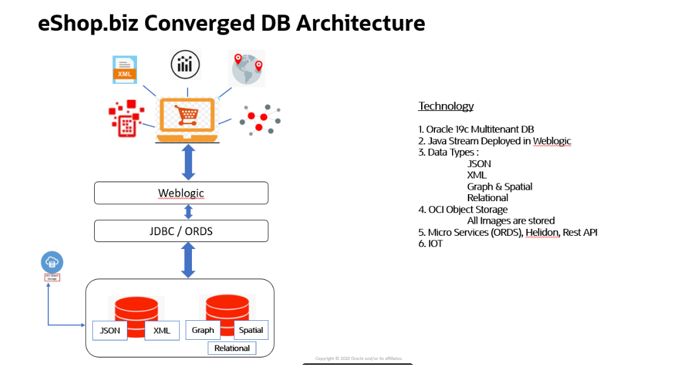

# Introduction

## eShop ##

The eShop company has a shopping cart web application to sell all clothing and fashion accessories to its customers.  The product details are all provided in JSON format by different vendors of the product and the customers shopping data is retained as XML as per the current single database used for the shopping application.  The store location details are stored as spatial data in a separate single purpose database and all analytical data for the application is residing in a different single purpose database.  In total., the application has to deal with multiple datatypes.
Hence, the eShop company earlier had overhead of connecting to different single-purpose databases to work on each datatype for its shopping cart web application.
The connections to databases and transactions involved with database is always costly and complex.  Because of these multiple single purpose databases, the eShop company had to have engineers knowing to handle these specific single purpose databases, bear the integration costs and complexities of handling the application code which talks to these different databases.  Scalability is another challenge the eShop company is facing due to the data fragmentation in the old architecture involving these multiple single-purpose databases.
The CTO of the company decides to re-write the e-shopping  web application using J2EE standards to host on WebLogic., the market leader for enterprise application services. Java developers at eShop can leverage the Oracle’s best JEE development tool JDeveloper for coding this new application. 

Oracle has Converged database to offer which supports all these and many more datatypes in one single database. The developers in eShop company now enjoy the freedom to connect to a single converged oracle database to handle JSON, XML, Spatial and Graph data for its application.  This doesn’t need the developers know how to deal with different data-type specific databases and the integration complexities beneath.
The data fragmentation across different databases is avoided with converged database in action. The overhead of security and integration cost is avoided. By eliminating data fragmentation, eShop can eliminate copy contagion. Application modules or services automatically use a single copy of shared data in a converged database. There are no errors or time delays due to data propagated. The power new generation oracle database and application server features like scaling, high-availability and DR options can all be seamlessly leveraged now.

Oracle Database is an excellent example of a converged database, as it provides support for Machine Learning, Blockchain, Graph, Spatial, JSON, REST, Events, Editions, and IoT Streaming as part of the core database at no additional cost. It allows you to support many diverse projects using a single platform, significantly reducing complexity and management overhead, while minimizing risk.
The new application re-written in J2EE standards using JDeveloper to deploy on WebLogic, demonstrates how convenient it is to work with converged oracle database.

 

[](youtube:Sbbw2mcrfiA)


## The Data Driven Application Challenge
Modern data driven applications usher in a more complexity with different data types (Relational, Document, Spatial, Graph) and workloads (Transactions, Analytics, ML,IOT). These require different database algorithms to solve and the two possible data strategies are Single Purpose best of breed database for each data type and workload OR use a converged database for all data types and workloads. 

Once we have a single purpose separate database for spatial, ML, Blockchain, JSON, graph etc. we are actually introducing many variables which inherently increases the complexity.

Single purpose Database would eventually end up doing a lot of custom work, writing more code independently using individual proprietary API's and transaction models. Propagating and transforming all these changes with fragmented data all over the place creates lot more complexity and there is definitely a need to integrate it with a lot of customizations. This Integration is a job that never ends.

The necessary features like security, availability, scalability are just very complex to achieve, as each of them has its own models to be built. Later, to propagate any of the smallest change and integrate its a huge activity. 

Availability, scalability, consistency, End to End security etc. are very limited in their areas by weakest of their databases that are implemented. Combining all of them gives worst of weakness. These systems are JUST NO economies of scale.


## Solving the Challenge
Oracle has been doing decades of innovation meeting the needs of mission critical complex systems by doing automation and this journey is continuing with emerging needs and solving real-world challenges like real-time analytics, scale out architecture, zero down time, and defense on cyberattacks. This automation expands to Infrastructure, database, Automated Data center operations and machine learning. 

Calendar, messaging, clock, and camera functions are now part of Mobile devices. Similarly, key-value, ML, JSON, Transactional, and Sharding are now features of Converged DB. 

[](youtube:9d76-LhgMQs)

The Converged Database architecture approach creates Data synergy and simplicity. Synergy across features makes the whole better than the sum of parts. Oracle Converged Database Supports all Workloads (Traditional, Next Generation) and Datatypes (Structured & Un-Structured )

Converged DB makes it much simpler to develop apps. Just call the SQL to run ML, GRAPH, Spatial, JSON, Blockchain etc.

Oracle converged DB on On-premise or on Oracle Cloud Delivers Union of Best Capabilities for each of data type and Workload. 
All those bottlenecks (Data Consistency, Data Security, Availability, Scalability, Cross Site Consistency) of single purpose database are solved in Oracle Converged Database. 

All of these capabilities create better and informed decisions by increasing the value of information and reducing the time to business insight.

## Before You Begin  
To complete this workshop, you will use a preconfigured Converged Database image available in Oracle's Cloud Marketplace to build your compute instance.  This image comes pre-installed with all the information you need to create your environment. 

The Image OCID is below. Please copy it to a notepad, you will need it for later.

  ````
  <copy>
  ocid1.image.oc1..aaaaaaaaqa2rgmwe7qjvscsagpyyog4j3ihgbt3dlpoz7zfrprx7ffdzbozq
  </copy>
  ````


### Preferred Shell
We recommend you run this workshop using the **Oracle Cloud Shell**.

## Converged Database Workshop Collection

- [WebLogic](?lab=weblogic-lab-1-intro-setup) - Use Rest API to add products to the eShop Application
- [Json](?lab=json-lab-1-intro-setup) - Store and read JSON documents from the Oracle Database
- [XML](?lab=xml-lab-1-setup)- Manage XML content in the Oracle Database
- [Spatial](?lab=spatial-lab-1-setup) - Work with Spatial Data in the Oracle Database
- [Graph](?lab=graph-lab-1-intro-setup) - Work with Graph Data in the Oracle Database
- [Cross Datatype](?lab=cross-lab-1-intro-usage) - Work with Cross Data Types

## Acknowledgements

- **Authors** - Balasubramanian Ramamoorthy, Dhananjay Kumar, Pradeep Chandramouli
- **Contributors** - Nishanth Kaushik,Kanika Sharma,Srinivas Pothukuchi,Arvind Bhope
- **Team** - North America AppDev Specialists
- **Last Updated By** - Kay Malcolm, Director, Database Product Management, June 2021
- **Expiration Date** - June 2021

## Issues?
Please submit an issue on our [issues](https://github.com/oracle/learning-library/issues) page. We review it regularly.


