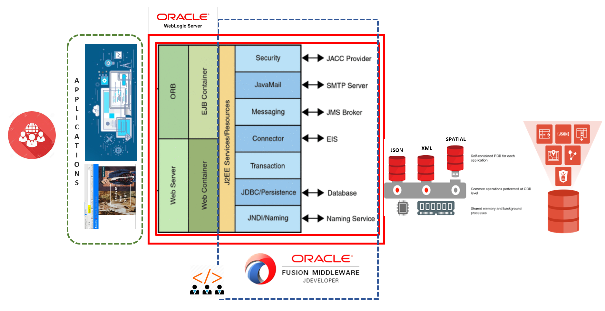

# Workshop Introduction and Overview #

## Converged Database with Weblogic for Developers
# Introduction

This workshop aims at providing hands-on labs for creating an eCommerce application using JDeveloper as an IDE. The labs show the ease of handling data stored as different datatypes like JSON, XML and Spatial as multiple pluggable databases in a single converged Oracle database.

The power of weblogic for JEE development like JNDI, DataSources, Maven Plugins and REST are leveraged in labs from a developers perspective.

*Estimated Workshop Time:* 3 Hours

### About Product/Technology
**Java EE**

Java Platform, Enterprise Edition (Java EE) is the standard in community-driven enterprise software. Java EE is developed using the Java Community Process, with contributions from industry experts, commercial and open source organizations, Java User Groups, and countless individuals. Each release integrates new features that align with industry needs, improves application portability, and increases developer productivity.

Java EE servers host several application component types that correspond to the tiers in a multitiered application. The Java EE server provides services to these components in the form of a container.

**WebLogic**

Oracle WebLogic Server is a scalable, enterprise-ready Java Platform, Enterprise Edition (Java EE) application server. The WebLogic Server infrastructure supports the deployment of many types of distributed applications and is an ideal foundation for building applications based on Service Oriented Architectures (SOA). 

The WebLogic Server complete implementation of the Java EE 6.0 specification provides a standard set of APIs for creating distributed Java applications that can access a wide variety of services, such as databases, messaging services, and connections to external enterprise systems. End-user clients access these applications using Web browser clients or Java clients.

### Objectives

In this workshop you will:
* Offload Converged Database features for Multiple Datatypes in a single JEE application
* Experience the ease of coding for different data types
* Leverage different built-in functions for JSON, XML, Graph and Spatial Data from Converged DB
* Develop REST end points for database development
* Consume out of box REST options from Converged Database in application

### Prerequisites

* An Oracle Free Tier, Always Free, Paid or LiveLabs Cloud Account
* Basic understanding of Java application development and any IDE

**Architecture Overview**

The Java EE application implements the enterprise services like security, portablity and developer productivity. A JEE server like WebLogic provides a platform to levrage all components of JEE for application development and hosting.

In this workshop however, we will be connecting to a converged database holding data in different datatypes using the JNDI APIs, build the application on JDeveloper IDE using Maven extension and deploy the code on WebLogic. We also levrage the REST support provided by WebLogic to expose data as REST end-points.

**Labs**

Converged Database with Weblogic for Developers workshop consists of 7 separate labs. The labs should be followed in order from Lab4-Lab10. There are also screen shots available throughout the labs to guide you through the exercises.  Additional information has been provided in the Appendix section of the workshop to help guide through the lab exercises.

* **Lab 4:** eSHOP Application

    This lab is designed to configure and launch eShop application on WebLogic

    *Estimated Lab Time:*  20 minutes

* **Lab 5:** Data Type Demonstration Tool

    This lab is to launch a pre-built application(Datatype Demonstration tool) used to perform CRUD operations on different datatypes

    *Estimated Lab Time:*  10 minutes

* **Lab 6:** JSON

    This lab demonstrates the ease of handling JSON data type in JAVA EE code. We will be performing insert, update and deletion of JSON data using the UI tool.

    *Estimated Lab Time:*  30 minutes

* **Lab 7:** XML

    This lab we will work on XML datatype in Converge database

    *Estimated Lab Time:* 30 Minutes

* **Lab 8:** SPATIAL

    This lab we will create sample SPATIAL data and work on SPATIAL datatype in Converge database

    *Estimated Lab Time:* 30 Minutes

* **Lab 9:** Cross Data Type (Optional)

    This lab will show you how to use cross data functions

    *Estimated Lab Time:* 15 Minutes

* **Lab 10:** ORDS as Microservice

    This lab demonstrates ORDS end-point as an alternate datasource

    *Estimated Lab Time:* 15 Minutes

You may now proceed to labs.

## Learn More

**Java EE**
- [Oracle J2EE (JEE)](https://www.oracle.com/in/java/technologies/java-ee-glance.html)

**WebLogic Resources**
- [Video PageBlogs](https://www.youtube.com/user/OracleWebLogic)
- [White Paper](https://www.oracle.com/middleware/weblogic/resources.html)
- [Product Page](https://www.oracle.com/java/weblogic/)

**JDeveloper**
- [Overview Video](https://www.youtube.com/watch?v=63rnCGawF9w)
- [Product Tutorial](https://docs.oracle.com/cd/E53569_01/tutorials/tut_ide/tut_ide.html)
- [Java Application Development](https://www.oracle.com/application-development/technologies/jdeveloper.html)

## Acknowledgements
- **Authors** - Pradeep Chandramouli, Nishant Kaushik, Kanika Sharma, Laxmi Amarappanavar, Balasubramanian Ramamoorthy, AppDev & Database Team, Oracle, October 2020
- **Contributors** - Meghana Banka, Rene Fontcha
- **Last Updated By/Date** - Kanika Sharma, NA Technology, October 2020

## See an issue?
Please submit feedback using this [form](https://apexapps.oracle.com/pls/apex/f?p=133:1:::::P1_FEEDBACK:1). Please include the *workshop name*, *lab* and *step* in your request.  If you don't see the workshop name listed, please enter it manually. If you would like us to follow up with you, enter your email in the *Feedback Comments* section.