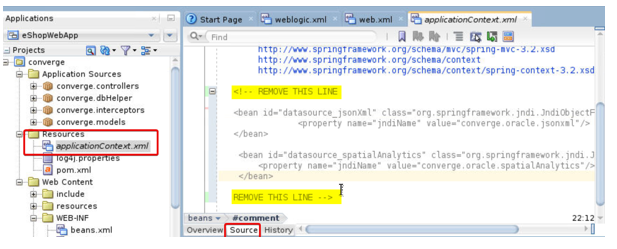
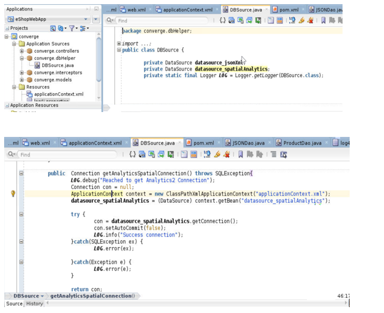
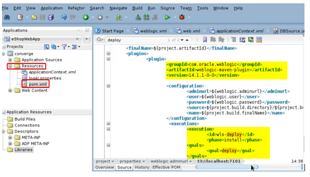
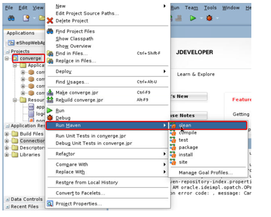
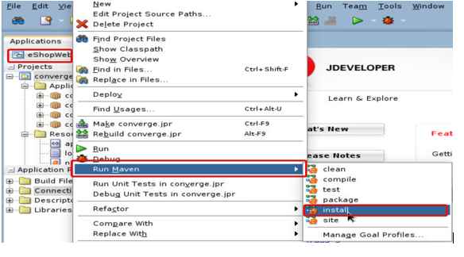
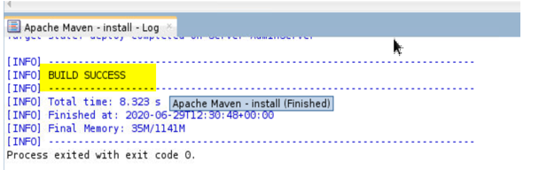
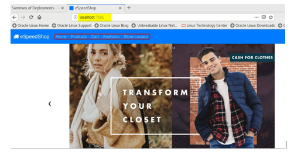
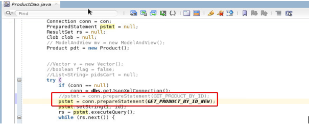

# Oracle JDeveloper 

## Introduction

yet to get 

## Before You Begin

This lab assumes you have completed the following labs:
- Lab 1:  Login to Oracle Cloud
- Lab 2:  Generate SSH Key
- Lab 3:  Create Compute instance 
- Lab 4:  Environment setup
- Pre-requisites from JDeveloper: Lab1 
 
## Step 1:	Use DataSource options to Connect eShop application to ConvergedDB

•	In JDeveloper, on the Project Navigation Menu on Left hand side, Expand “Resource”.  Double click on “applicationContext.xml.  In the Main window of the JDeveloper, Click on “Source”

 

This application is based on SpringFrameWork.  For database connection we are using the JNDI objects. WebLogic, which is built on JEE standards references all its components for applications as JNDI entries.  For connecting to converged database which holds multiple datatype based data in Oracle 19c database., we have to create datasources with same JNDI name as in the code above.

•	Delete the lines in applicationContext.xml with the text “REMOVE THIS LINE” . Click Ctrl+S to save the code.

## Step 2:  Create Data Source for eShop application

•	Open a Terminal window using the Icon on the desktop

•	As Oracle user, Navigate to folder where the edited datasource create script exits

````
<copy>
cd /u01/middleware_demo/scripts
</copy>
````

•	Source the lab profile file

````
<copy>
. /u01/middleware_demo/scripts/setWLS14Profile.sh (DOT Space PATH)
</copy>
````

•	Source the setDomainEnv.sh
````
<copy>
sh $DOMAIN_HOME/bin/setDomainEnv.sh
</copy>
````

•	Import the eShop application code from git repository. Navigate to the utilities folder and execute the python scripts needed to create datasources needed for eShop application

````
<copy>
cd /u01/middleware_demo/converge-java/utilities
</copy>
````

•	Execute the two WLST python scripts to create two datasources

````
<copy>
java weblogic.WLST createAppDataSourceJXL.py

java weblogic.WLST createAppDataSourceSGR.py
</copy>
````

•	Navigate back to weblogic admin console and click on “Data Sources” under “Services”

•	You will observe that the new datasources “datasource_jsonXml” and “datasource_spatialAnalytics” are created

 

## Step 3:  Verify Database Connection Function

•	In JDeveloper, on the Project Navigation Menu on Left hand side, Expand “Application Sources”. 

•	Expand “Converge.dbHelper”

•	Double click on “DBSource.java to see the logic of connecting to the required converged database

 

Just observe the two functions getJsonXmlConnection() and getAnalyticsSpatialConnection() in the DBSource.java.  We are using only the DataSource java class to get a connection and we are not handling any properties related to the connection in the java code.

The advantages being, the code is secure and free from hard coded database settings.
The performance parameters can be independently tuned in the weblogic console by an administrator with full freedom to java developer to not to worry about the agnostics of database complexities
Also, the java developer need not be aware of the required usernames and passwords needed to connect to the database.  

For each kind of datatype, the underlying user schema is hidden from the java developer.
Now let us build the deployable artifacts and deploy on weblogic.
But before let us analyse how we can do a direct deployment of application on to weblogic using two powerful utilities given out of box by weblogic called “weblogic.deployer” and the “Weblogic-Maven Plugin” which we configured in the pre-requisites

All these configurations are in POM.xml

## Step 4: Analyse Deployment automation 

In this section we will walk through the configurations done on the Maven side to import the required dependencies, automate the code build and depoy the built artefact on to weblogic.


•	In JDeveloper, on the Project Navigation Menu on Left hand side, Expand “Resource”.  Double click on “pom.xml.  In the Main window of the JDeveloper, Click on “Source”

 

We can see the weblogic-maven-plugin which calls the weblogic.deployer tool internally for and execution goal of “deploy” in a Maven call.

## Step 5:  Build, Deploy and Verify application

In this section, we will be building the code of eShop using Maven.  JDeveloper provides tools to build and deploy code on to any attached server from the UI.  We will verify the build logs and the successfully deployed application.

•	Under Applications Navigation Panel in JDeveloper, Under “Projects”, right click on “converge”

•	Select “Run Maven” 
    Clean

 

•	Again right click on “converge”, Select “Run Maven”  Install

NOTE:  If you have not stopped the “mainWebApp” application on weblogic console as mentioned in the pre-requisites, you will see a “BUILD FAILED” message

 

•	In the Logs section “Apache-Maven-Install-Log” you will see a “BUILD SUCCESS”.

 

•	Scroll up the log and observe that the Maven automation has created a deployable war file called converge.war under “/u01/middleware_demo/converge-java/target/” folder and using the “weblogic.deployer” tool, has installed it on the configured WebLogic 14 on AdminServer

•	Access the application by navigating to http://localhost:7101/ 

•	Access all endpoints and features of the application like Dashboard, shoppig cart, searc etc.

 

•	Do a sample shopping test and confirm the application working.

## Step 6:  Query JSON datatype from database in Java Code

In this section, we will see how the sample code is connecting to converged database to collect the product information which is stored as JSON object in the database.  Typically, the developer has written code to retrieve the JSON object as a CLOB from database and do string manipulations in Java coding to get the values across each column for each row of data.  Oracle converged database offers options of retrieve each Jason parameter from the database which can be directly read as a string or preferred data type in the application code. 

In the ProductDao.java we have written SQL query to get the products by ID which is used when each individual product details are accessed in the application.  We will change the existing sql query to access the product by ID and the way we handle it in creating a product object using the query

•	In the JDeveloper under Projects Navigation Pane, under 
“Converge” 
“Application Sources”
expand “converge.controllers”.

•	Double click on “ProductDao.java” to open it in main window

•	In the ProductDao Class, check the sql query associated with the string “GET PRODUCT BY ID”
in the declaration of the class.

It is a simple select statement retrieving the entire JSON string stored in the Product table in the product_document column where the product ID matches with the input

•	Observe the getProductById(Connection con, String id) method in the same file

•	The entire clob string is parsed as a JSON object., and the JSON element value is extracted from the JSON object and typecasted to a string.  Later the Product OBJECT’s property is set using the value
Now let us change the code:

•	In the ProductDao class, declare a string variable “GET PRODUCT BY ID NEW” containing the sql query  

````
<copy>
select p.product_document.pid,p.product_document.category,p.product_document.title,p.product_document.details,p.product_document.price,p.product_document.picture from products p where p.product_document.pid=?;
</copy>
````

````
 private static String GET_PRODUCT_BY_ID_NEW = "select p.product_document.pid,p.product_document.category,p.product_document.title\r\n" + ",p.product_document.details,p.product_document.price,p.product_document.picture from products p where p.product_document.pid=?";
 ````

 •	In the function getProductById(Connection con, String id) comment the line 

 ````
 <copy>
 pstmt = conn.prepareStatement(GET_PRODUCT_BY_ID);
 </copy>
 ````

 add the line below:

````
 pstmt = conn.prepareStatement(GET_PRODUCT_BY_ID_NEW);
````

 

Comment the lines below

````
clob = rs.getClob(1);
String wholeClob = clob.getSubString(1, (int) clob.length());

JSONObject jo = (JSONObject) new JSONParser().parse(wholeClob);
if(jo.get("pid")== null) continue;
pdt.setCategory((String) jo.get("category"));
pdt.setDetails((String) jo.get("details"));
pdt.setPicture((String) jo.get("picture"));
pdt.setPid(jo.get("pid").toString());
pdt.setPrice(jo.get("price").toString());
pdt.setTitle((String) jo.get("title"));

````
Uncomment the lines

````
pdt.setPid(rs.getString(1));
pdt.setCategory(rs.getString(2));
pdt.setTitle(rs.getString(3));
pdt.setDetails(rs.getString(4));
pdt.setPrice(rs.getString(5));
pdt.setPicture(rs.getString(6));

````

In the new way of coding, you see that the string values for each literal in the document is retrieved directly. The converged database is capable of querying JSON literal values directly from dtabase

•	Save all files

•	From the weblogic consoles under deployments, navigate to “control” tab, stop the deployed application “Converge”.  Use “Force stop Now”

•	Click on “Configuration” tab, select the stopped “converge” application which is in “Prepared” state.

•	Click “Delete”

Now we can re-compile the new code and deploy it on Weblogic from JDeveloper

•	Navigate back to JDeveloper, under “Project” menu, right click on 
“converge” 
Click “Run Maven” 
Clean

•	Again, right click on 
“converge” 
 Click “Run Maven”
 Install

Check the eShop application by checking the details on an individual product., You do not see ay difference.  The JSON elements holding the values of price, title and description are rightly fetching the same data with the new query as well.


## Acknowledgements

- **Authors** - Balasubramanian Ramamoorthy, Dhananjay Kumar, Pradeep Chandramouli
- **Contributors** - Nishanth Kaushik,Kanika Sharma,Srinivas Pothukuchi,Arvind Bhope
- **Team** - North America AppDev Specialists
- **Last Updated By** - Kay Malcolm, Director, Database Product Management, June 2021
- **Expiration Date** - June 2021


## Issues?
Please submit an issue on our [issues](https://github.com/oracle/learning-library/issues) page. We review it regularly.


