# Introduction to JDeveloper
<br>
Oracle JDeveloper is a free integrated development environment that simplifies the development of Java-based applications addressing every step of the application lifecycle. 

JDeveloper offers complete end-to-end development for Oracle's platform and Oracle's applications.

[](youtube:63rnCGawF9w)

## Pre-requisites

**Add application server to JDeveloper**

•	Click on the “Coffee Cup” Icon of “Oracle JDeveloper 12c” on the desktop to open the Oracle JDeveloper IDE

•	When prompted for “Select Role”, opt for “Studio Developer” Role and Click “OK” button.  This role has access to all features of JDeveloper.  We need it for accessing different kind of project templates to build the eStore application

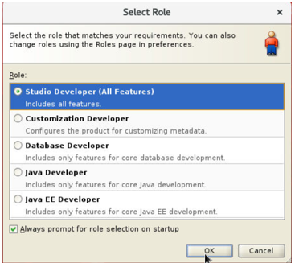

The JDeveloper needs to be attached to a working WebLogic server to test the code we write on the fly.  JDeveloper Studio Edition has a built-in WebLogic instance.
But in this lab we will use the pre-installed WebLogic 14 instance

•	In the main screen of JDeveloper, Click on “Window”, Click “Application Servers” or press Ctrl+Shift+G

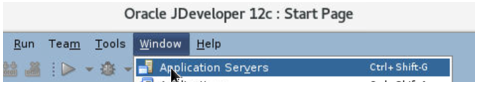

•	In the left hand navigator, expand “Application Servers” to see the Integrated WebLogic. Right Click on “Application Servers” and Click “New Application Server …”

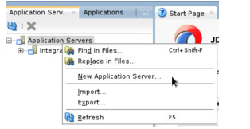

•	Select “Standalone Server”, Click Next

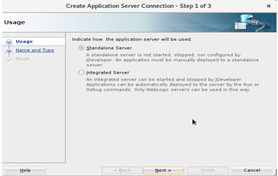

•	Provide a valid name like MyWLS14 for “Connection Name”, Select “Weblogic 12.x” as “Connection Type”. Click Next

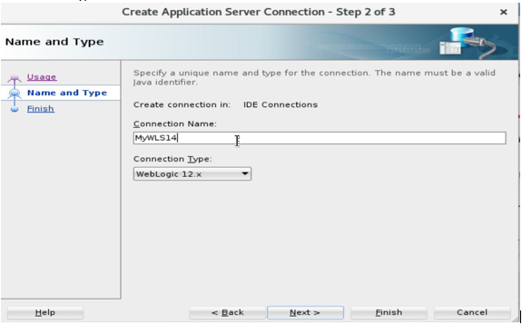

•	Provide “weblogic” as UserName and “Oracle123!” as password.  These are the credentials of the Weblogic 14c administrator user. Click Next

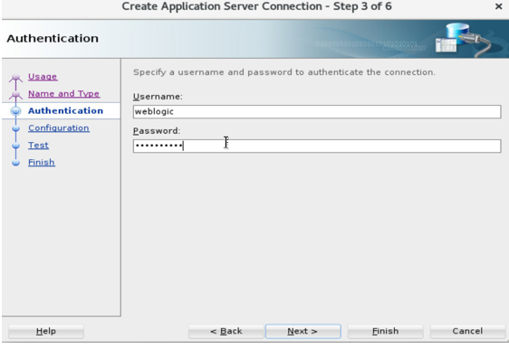

•	Change port to 7101, ssl port to 7201 and “WebLogic Domain” value to wl_server. Click Next

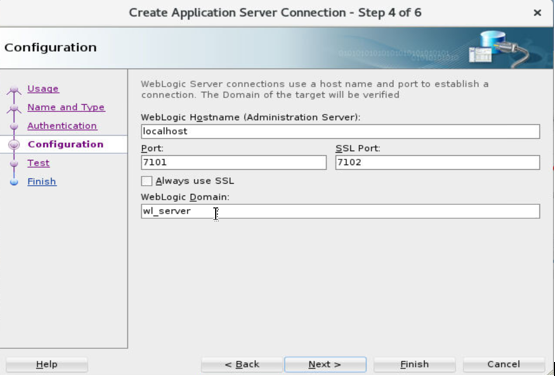

•	Click on “Test Connection” button.  When all the tests are successful. Click Finish

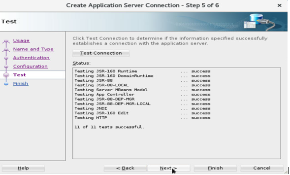

## Setup Maven plugin for Weblogic 14.1.1

•	As oracle user, Change directory to 

````
/u01/middleware/14c/oracle_common/plugins/maven/com/oracle/maven/oracle-maven-sync/14.1.1

cd /u01/middleware/14c/oracle_common/plugins/maven/com/oracle/maven/oracle-maven-sync/14.1.1
````

•	Source the WebLogic Profile settings file under /u01/middleware_demo/scripts.  This will help setup the mvn in the path

````
<copy>
. /u01/middleware_demo/scripts/setWLS14Profile.sh
</copy>
````

•	Execute the command below to install the weblogic-maven sync plugin

````
<copy>
mvn install:install-file -DpomFile=oracle-maven-sync-14.4.1.pom -Dfile=oracle-maven-sync-14.4.1.jar
</copy>
````
•	Execute the below command to push the maven sync plugin to weblogic 14 home directory

````
<copy>
mvn com.oracle.maven:oracle-maven-sync:push -DoracleHome=/u01/middleware/14c/
</copy>
````

## Install required JDBC jar files in Maven Repository

•	Navigate to source code folder.  The required jars have been provided locally on the git to avoid a download.

````
<copy>
cd /u01/middleware_demo/converge-java/utilities
<copy>
````

•	Execute the maven commands to include the jdbc jar and the xml jar for database in the current maven local repository.  All other required dependencies will be downloaded on the fly

````
<copy>
mvn install:install-file -Dfile=/u01/middleware_demo/converge-java/utilities/ojdbc8.jar -DgroupId=com.oracle -DartifactId=ojdbc8 -Dversion=19.3 -Dpackaging=jar
</copy>
````

````
<copy>
mvn install:install-file -Dfile=/u01/middleware_demo/converge-java/utilities/xdb6.jar -DgroupId=com.oracle.jdbc -DartifactId=xdb6 -Dversion=12.2.0.1 -Dpackaging=jar
</copy>
````

## Disable default application on Root Context

•	Make sure the WebLogic services are started on the node

•	Logon to weblogic admin server console by navigating to http://localhost:7101/console in a browser and logging in as weblogic/Oracle123!

•	On the left hand side “Domain Structure” Navigation window, Click on Deployments

•	Clic on “Control” tab

•	Navigate through the pages listing the deployments to find “mainWebApp” application

•	Select the checkbox next to “mainWebApp”. Click on “Stop” button. Select “Force Stop Now” option

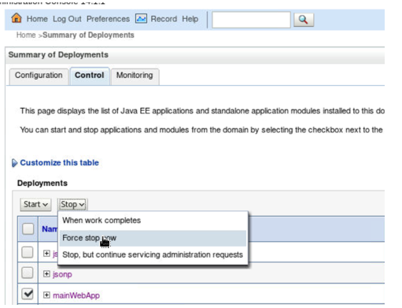

We must stop this application because its context path is root and our eShop application also is designed to be having the root context path.  Two applications cannot have the same context path. If this step is not done, we will see error for deployment of eShop application from JDeveloper later

## Create Maven Code Project on JDeveloper and Import Code

•	In the JDeveloper, Click on “Windows”  “Application”

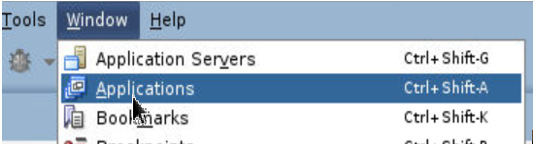

•	Click on “New Application” in the left hand side navigation menu

•	Select “Custom Application” from the options and click “OK”

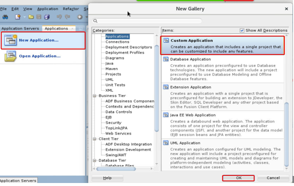

•	Provide a valid “Application Name” like “eShopCode-V1” and Click “Finish”

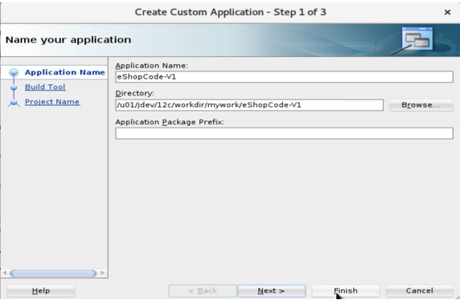

•	In the JDeveloper console., on the main Menu, click “File”  “Import”

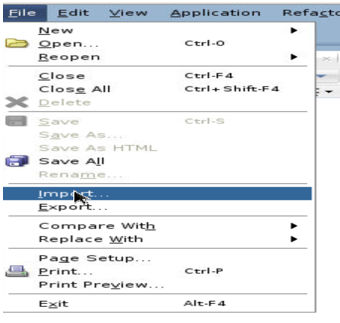

•	In the “Import” Window, select “Maven Project”.  Click “OK”

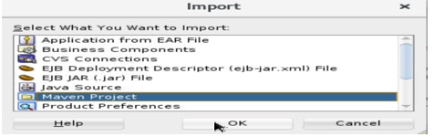

•	Use the Search Icon and navigate to /u01/middleware_demo/converge-java folder against the “Root Directory” .  Leave the “Settings File” option to default.  Select the checkbox against “pom.xml” under th “Project” options. Click “OK”

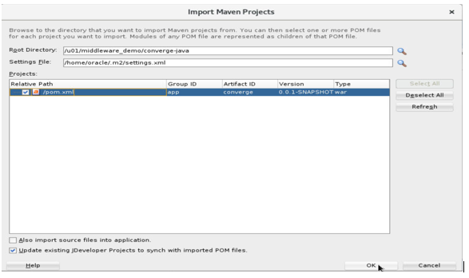

•	Provide a proper application name like “eShopWebApp”. Click “OK”

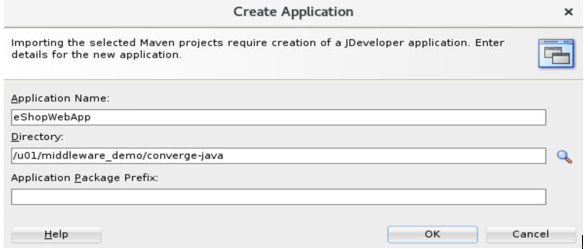

•	JDeveloper will take some time to import the application code

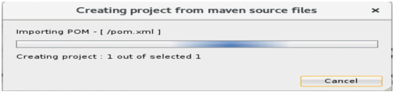

•	Expand all “+” signs under “Converge” beneath the “Projects” tab on left hand side navigation bar to see different RESOURCES, WEB COMPONENTS and PACKAGES used in the eShop code

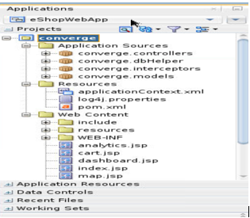


## Know more about JDeveloper

[Oracle JDeveloper](https://www.oracle.com/application-development/technologies/jdeveloper.html) 

[Java-based Application Development](https://www.oracle.com/application-development/technologies/jdeveloper.html) 


## Acknowledgements

- **Authors** - Balasubramanian Ramamoorthy, Dhananjay Kumar, Pradeep Chandramouli
- **Contributors** - Nishanth Kaushik,Kanika Sharma,Srinivas Pothukuchi,Arvind Bhope
- **Team** - North America AppDev Specialists
- **Last Updated By** - Kay Malcolm, Director, Database Product Management, June 2021
- **Expiration Date** - June 2021


## Issues?
Please submit an issue on our [issues](https://github.com/oracle/learning-library/issues) page. We review it regularly.


