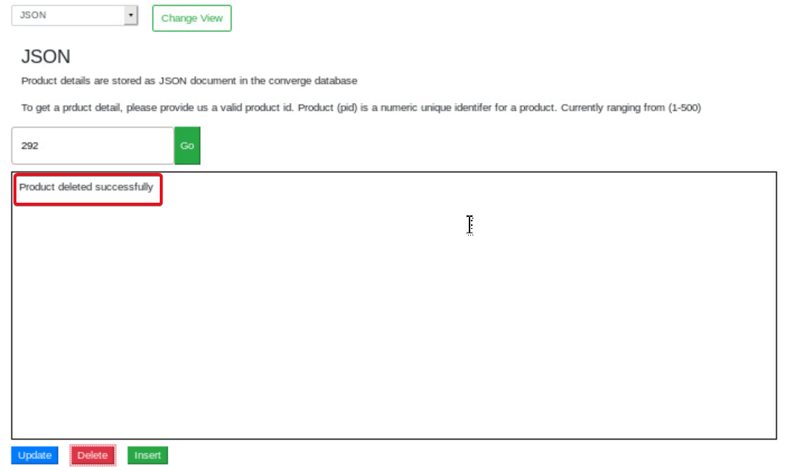
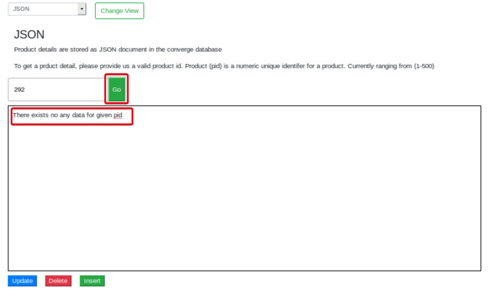
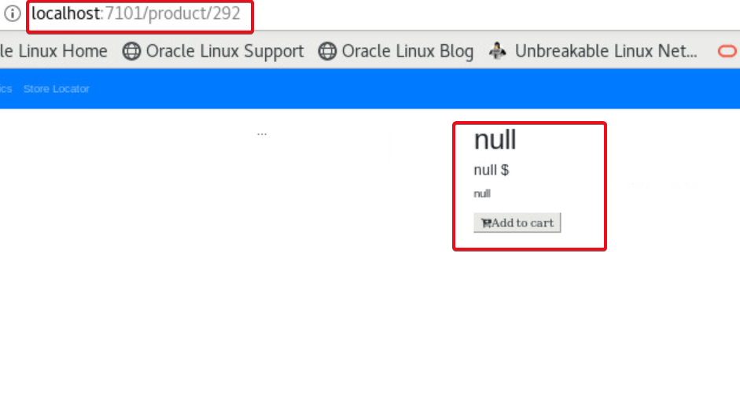
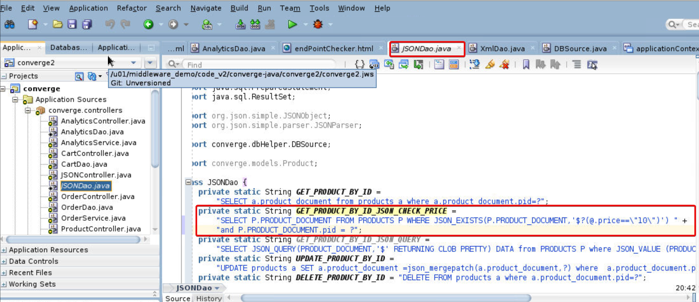
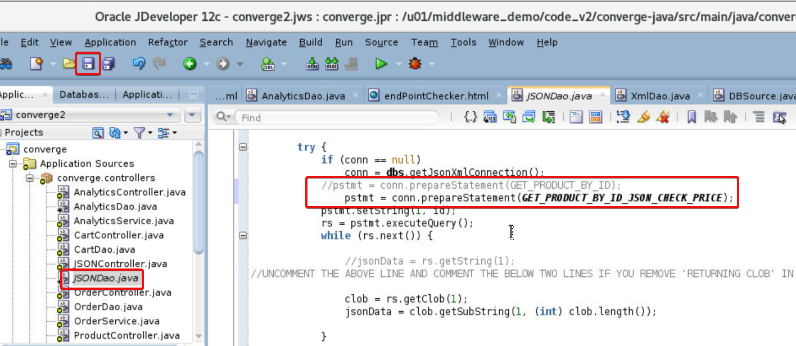
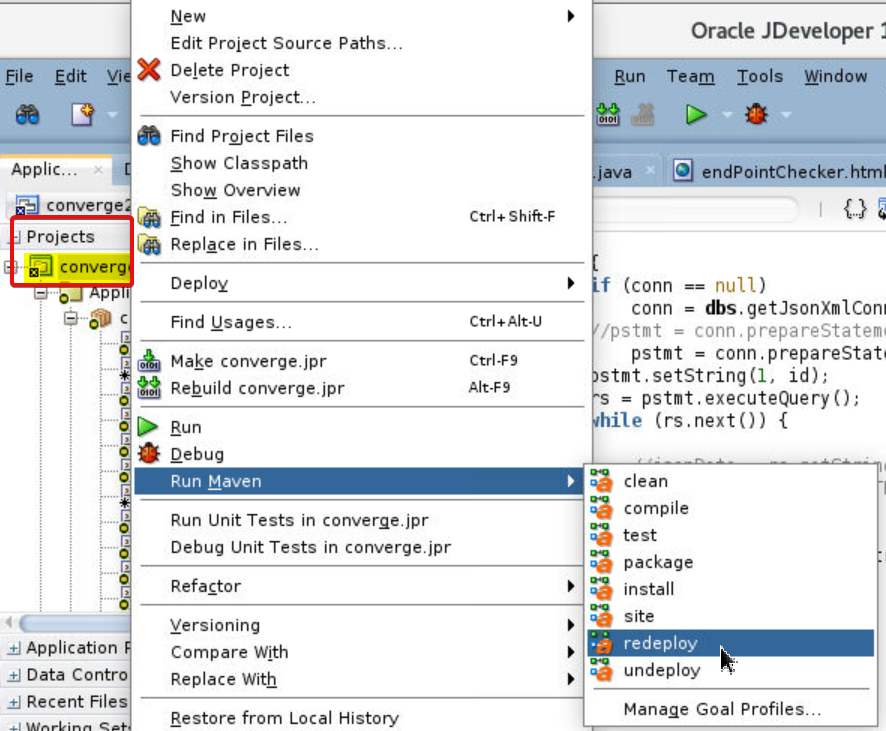

# Oracle JSON 

## Introduction

In this lab we will walk through the SQL queries containing the built-in functions provided for JSON datatype. Will modify the code, re-build and re-deploy the eShop application. Will learn to write new conditions to access selective JSON data from the converged database using data type  demonstration tool. Will demonstrates how to create REST endpoints for publishing JSON data. Will perform insert, update and deletion of JSON data using the UI tool

Estimated Lab Time: 45 Minutes

### **Prerequisites**

This lab assumes you have completed the following labs:
- Lab 1: Generate SSH Key - Cloud Shell
- Lab 2: Setup Compute Instance
- Lab 3: Start Services
- Lab 4: Deploy eSHOP Application
- Lab 5: Data type demonstrator tool

## Step-1: Retrieve JSON data

1. Open the Firefox browser and navigate to http://localhost:7101/resources/html/endPointChecker.html. OR You can use the bookmark **DataType-End Point Check Utility** under **ConvergedDB-Workshp in Bookmark Toolbar**

2. Click on the drop-down to see the list of datatypes shown in workshop

3. Select **JSON** datatype and click on **Change View** button to change

    

4. Search for product with ID **292** and Click on **Go** button

5.	In the text area you will find the JSON data related to product with ID 292 displayed

    

6. To verify the product on eShop application, Open the firefox browser in the VNC session (Or a new tab if already open) and enter the URL http://localhost:7101/product/292 to see the details of the product graphically
  

7.	Verify the PID, Details and Title

## Step 2: Update JSON data

1.	In the search result occurring after searching for product 292, update the price of the product from 12$ to 14$ in the text area

   

2.	Click on the blue **Update** button below the text area

3.	You will observe the message “1 records updated”

4.	To verify the product on eShop application, Open the firefox browser in the VNC session (Or a new tab if already open) and enter the URL http://localhost:7101/product/292 to see the details of the product graphically

    

5.	Again, search for product **292**, to observe the results with updated price value in the JSON object retrieved from database
    
    

   JSON manipulation function which is supplied out of the box called JSON_MERGEPATCH which is entirely replacing the JSON text with the new text is used within the code to update JSON data.  Similarly, we can re-write the query to update only a particular field and value in JSON by other methods provided to scan through and manipulate JSON key-value pairs in Oracle Converged DB for JSON.

## Step 3: Delete JSON data

1. Search for product with ID **292** and Click on **Go** button

2. Click on red **Delete** button below the search result display text area

    

3. The deletion confirmation message is displayed

    

4. Click on **Go** button again to search for product with ID 292

5. The unavailability message is displayed

    

6. To verify the product on eShop application, Open the firefox browser in the VNC session (Or a new tab if already open) and enter the URL http://localhost:7101/product/292 

7. You will find the product missing from the JSON database
   
   

## Step 4: Insert JSON data

1.	Open the Firefox browser and navigate to http://localhost:7101/resources/html/endPointChecker.html. OR You can use the bookmark **DataType-End Point Check Utility** under **ConvergedDB-Workshp in Bookmark Toolbar**

   If the tool is already open, continue

2.	Click on the drop-down to see the list of datatypes shown in workshop

3.	Select **JSON** datatype and click on **Change View** button to change

4.	In the text area, paste the below JSON data about product **292**

    {"pid":"292","category":"Earring ","title":"Earring 1","details":"Earrings-aiony-haust-o08tVPuvDcQ-unsplash.jpg","price":"2","picture":"https://objectstorage.us-ashburn-1.oraclecloud.com/n/orasenatdpltsecitom03/b/ConvergedDB4/o/Earrings-aiony-haust-o08tVPuvDcQ-unsplash.jpg"}

5. Click on green **Insert** button
    
    

6. Data insert confirmation message is displayed.
    
    

7. Search for product id **292** and Click **Go**

8. The newly inserted product details are displayed in the text area

    

9. To verify the product on eShop application, Open the firefox browser in the VNC session (Or a new tab if already open) and enter the URL http://localhost:7101/product/292 to see the details of the product graphically

    

10.	Verify the PID, Details and Title

## Step 5: Update JSON Query and verify
   
 We have searched and handled JSON data based on the product id.  Now what if we want to get the products by ID only if the price of the product is $10?  

 There is no need to write special queries to scan through the JSON data in the database.  Oracle provides a function called JSON_EXISTS to check through the values of any key in the JSON data construct.
 
 In this section, we will replace the query helping search product by ID to enhance the search with products of 10$ value.
    
 To achieve this, lets replace the query beneath with a new query having the condition required.

1. Open the JDeveloper on the VNC desktop or if you already have it open continue

2. navigate to In JDeveloper open the **JSONDao.java** under **Projects->converge->Application Sources->converge.controllers** by double clicking on the file

3. In the declaration section at top of the file (around line 16) check the GET\_PRODUCT\_BY\_ID string and the sql select statement

4. Compare the query with the one against GET_PRODUCT\_BY\_ID\_JSON\_CHECK\_PRICE.

    

  We are first using function JSON\_EXISTS which will do a verification if the data is in the JSON format and if the condition is met. 

  You can also see that we are simply using the key “Price” as if in a relational database not even bothering that it’s a key – value entry in a JSON text inside a database.  That’s the power and ease of handing JSON data in Oracle Converged Database.

5. Navigate down in JSONDao.java to function getProductByID()

6. Uncomment the line

  ````
   <copy>
   pstmt = conn.prepareStatement(GET_PRODUCT_BY_ID_JSON_CHECK_PRICE);
   Comment out the line
   pstmt = conn.prepareStatement(GET_PRODUCT_BY_ID);
   </copy>
  ````
  
  

7.	Click on **Save** button

8.	Right Click on **Converge**

9.	Click on **Run Maven** and click on **redeploy**
    
    

10.	In the JDeveloper Log message area, you will see the successful redeployment
    
    

11.	Navigate back to browser to the **End Point Checker** tool under http://localhost:7101/resources/html/endPointChecker.html

12.	Refresh couple of times to ensure avoiding pages from cache	

13.	Enter **292** as product ID and Click **Go** You will NOT see the product details as JSON in the text area., as we have set the Price condition to $10., and the product we are trying to get data is worth $12
   
    

14.	Enter product with ID **11** and click Go

15.	You will see the product details retrieved as the price is $10

    

 OPTIONAL
 You can also try the select statement in GET\_PRODUCT\_BY\_ID\_JSON\_QUERY string in JSONDao.java which has a SQL statement containing built-in JSON operational functions JSON\_QUERY and JSON\_VALUE to handle the same request.

 JSON\_QUERY finds one or more specified JSON values in JSON data and returns the values in a character string. expr. Use this clause to specify the JSON data to be evaluated. For expr , specify an expression that evaluates to a text literal.

 JSON\_VALUE selects a scalar value from JSON data and returns it as a SQL value. You can also use json\_value to create function-based B-tree indexes for use with JSON data — see Indexes for JSON Data. Function json_value has two required arguments and accepts optional returning and error clauses
 Repeat the steps done above restrict product search to items with Price $10 by changing the query statement and re-deploying the app.
  

## Acknowledgements

- **Authors** - Pradeep Chandramouli, Nishant Kaushik
- **Contributors** - - Laxmi Amarappanavar, Kanika Sharma, Balasubramanian Ramamoorthy
- **Team** - 
- **Last Updated By** - 
- **Expiration Date** -    

## See an issue?
Please submit feedback using this 
[form](https://apexapps.oracle.com/pls/apex/f?p=133:1:::::P1_FEEDBACK:1)  
Please include the *workshop name*, *lab* and *step* in your request.  If you don't see the workshop name listed, please enter it manually. If you would like for us to follow up with you, enter your email in the *Feedback Comments* section.