 
## Step 2: EDA

1. Import the required packages

````
<copy>
import pandas as pd
import numpy as np

import warnings
warnings.filterwarnings("ignore")

import seaborn as sns
import matplotlib.pyplot as plt
%matplotlib inline
</copy>
````

2. We start with EDA (Exploratory Data Analysis). EDA is an approach to analyzing data sets to summarize their main characteristics, often with visual methods.

````
<copy>
CleanDataset = r'../3-Cleaned-Dataset/OnlineRetail_Cleaned_New.csv'
</copy>
````

3. Load the dataset into python data frame.

````
<copy>
#load the dataset
df_retail = pd.read_csv(CleanDataset)
</copy>
````

4. Check the size of data (Number of Rows, Number of Columns)

````
<copy>
#shape of our dataset
print("The shape of our dataset is: ", df_retail.shape)
</copy>
````

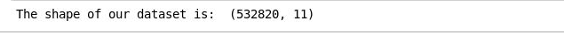 


5. List the Top 10 rows of dataset

````
<copy>
#check the head of the dataset
cleanedDataHead = df_retail.head(10)
cleanedDataHead.to_csv("cleanedDataHead.csv")
cleanedDataHead
</copy>
````

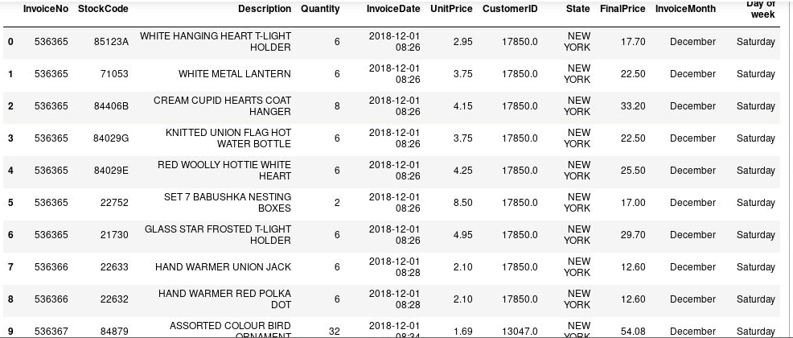 

6. List last 10 rows of dataset

````
<copy>
cleanedDataTail = df_retail.tail(10)
cleanedDataTail.to_csv("cleanedDataTail.csv")
cleanedDataTail
</copy>
````
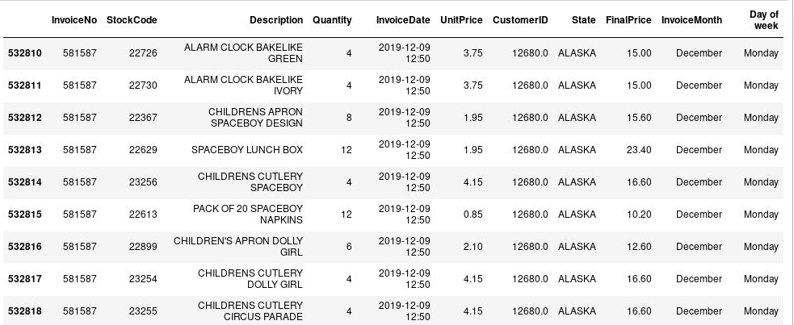 

7. Let's explore our dataset first by getting more information about rows and columns.

````
<copy>
df_retail.info()
</copy>
````

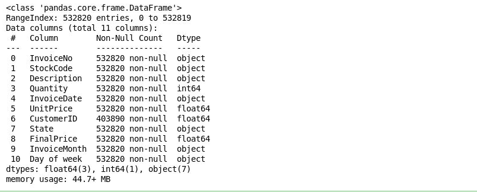 

Our dataset is composed of 541909 rows and 8 columns. When going through the columns, we notice that we have some missing values in the CustomerID column, as it only has 406829 values. Also the column Description has missing values. So, that should be considered when applying exploration to our dataset.

8. Exploring Unique Values of each Attribute

````
<copy>
print("Number of transactions: ", df_retail['InvoiceNo'].nunique())
print("Number of products bought: ",df_retail['StockCode'].nunique())
print("Number of customers:", df_retail['CustomerID'].nunique() )
print("Percentage of customers NA: ", round(df_retail['CustomerID'].isnull().sum() * 100 / len(df_retail),2),"%" )
print('Number of states: ',df_retail['State'].nunique())
</copy>
````
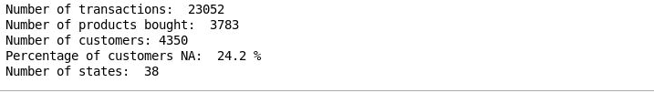 

**Note:** The number of NA customers is quite large and that would impact the results.

This dataframe contains 8 variables that correspond to:

**InvoiceNo:** Invoice number. Nominal, a 6-digit integral number uniquely assigned to each transaction. If this code starts with letter 'c', it indicates a cancellation.

**StockCode:** Product (item) code. Nominal, a 5-digit integral number uniquely assigned to each distinct product.

**Description:** Product (item) name. Nominal.

**Quantity:** The quantities of each product (item) per transaction. Numeric.

**InvoiceDate:** Invoice Date and time. Numeric, the day and time when each transaction was generated.

**UnitPrice:** Unit price. Numeric, Product price per unit in dollars.

**CustomerID:** Customer number. Nominal, a 5-digit integral number uniquely assigned to each customer.

**USStates:** State name. Nominal, the name of the state where each customer resides.

Now, let's have an idea about the quantitative data (Quantity & UnitPrice)

9. Compute a summary of statistics pertaining to the Data columns

````
<copy>
dataDescribe = df_retail.describe()
dataDescribe.to_csv("dataDescribe.csv")
dataDescribe
</copy>
````

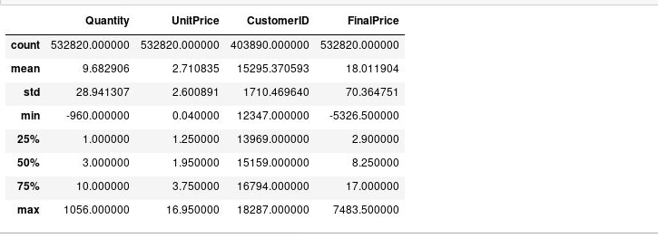

The first thing to notice is that we have some negative values in our dataset. Maybe, this could mean that these quantity was returned or cancelled. (Same for UnitPrice negative values).

**Cancelled Invoices**

As mentioned in the description of the dataset, some InvoiceNo start with the letter "c" = cancelled. Let's see if our hypothesis is correct about the negative quantity: -80995. We will look for the list of cancelled invoices and check if there is an invoice with that quantity.


1. Get the cancelled transactions

````
<copy>
cancelled_orders = df_retail[df_retail['InvoiceNo'].astype(str).str.contains('C')]
cancelledHead = cancelled_orders.head()
cancelledHead.to_csv("cancelledHead.csv")
cancelledHead
</copy>
````

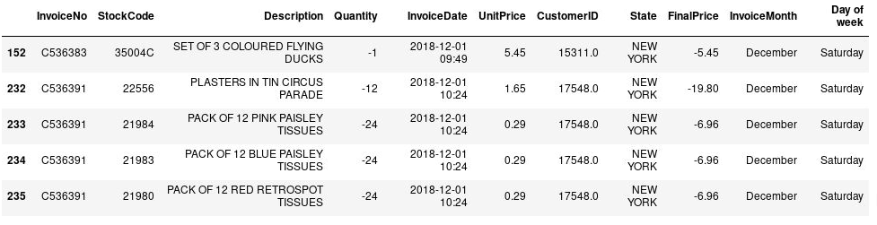

2. Search for one cancelled transaction

````
<copy>
cancelled_orders[cancelled_orders['Quantity']==-960]
</copy>
````
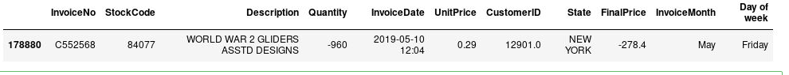

````
<copy>
cancelled_orders[cancelled_orders['Quantity']>0]
</copy>
````

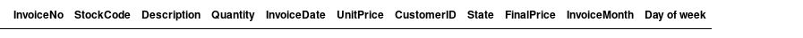

As expected, negative values in the Quantity column, mean that it is a cancelled quantity.

**Question:** How much cancelled orders do we have?

````
<copy>
#check how many rows our dataframe of cancelled orders contain
print("We have ",len(cancelled_orders), " cancelled orders.")
#percentage of cancelled orders in total orders
total_orders = df_retail['InvoiceNo'].nunique()
cancelled_number = len(cancelled_orders)
print('Percentage of orders canceled: {}/{} ({:.2f}%) '.format(cancelled_number, total_orders, cancelled_number/total_orders*100))
</copy>
````
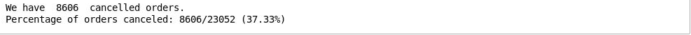

**Answer:** We have a large percentage of cancelled orders of 35%. Studying these cancelled orders may help in preventing future cancellation.

**Explore by products per invoice**

**Question:** In the description of our dataframe, we found that 75% of customers buy a quantity of 10. Are they from the same product? Let's examine how many products are purchased.

````
<copy>
temp_df = df_retail.groupby(['InvoiceNo','CustomerID'],as_index=False)['InvoiceDate'].count()
transaction_df = temp_df.rename(columns= {'InvoiceDate':'Number of Products'})
transactionHead = transaction_df.head()
transactionHead.to_csv("transactionHead.csv")
transactionHead
</copy>
````
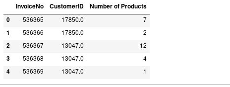

````
<copy>
transaction_df.size
</copy>
````
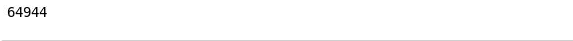

````
<copy>
transactionDesc = transaction_df.describe()
transactionDesc.to_csv("transactionDesc.csv")
transactionDesc
</copy>
````
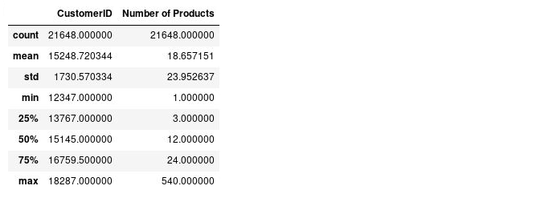

**Check the product distribution in dataset**

````
<copy>
fig, ax = plt.subplots()
fig.set_size_inches(11.7, 10)
sns.distplot(transaction_df['Number of Products'],ax=ax)
plt.show()
</copy>
````
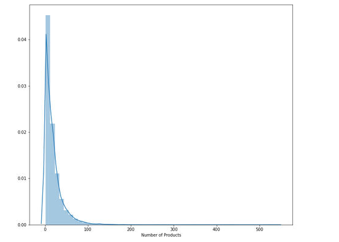

We have a skewed distribution of products. Most people buy less than 25 items.

**Customers by state**

**Add a new column 'total_cost' to the retail data. It is computed by multiplying quantity with unit price**

````
<copy>
df_retail['total_cost'] = df_retail['Quantity'] * df_retail['UnitPrice']
</copy>
````

````
<copy>
otalCostAddHead = df_retail.head()
TotalCostAddHead.to_csv("TotalCostAddHead.csv")
TotalCostAddHead
</copy>
````
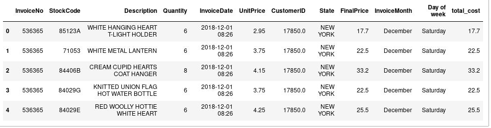

**What is the total revenue per State?**
````
<copy>
import seaborn as sns
import matplotlib.pyplot as plt
%matplotlib inline
fig, ax = plt.subplots()
fig.set_size_inches(13, 11.5)
ax=sns.barplot(x='State', y='total_cost',data=df_retail,estimator=max,ax=ax)
ax.set_xticklabels(ax.get_xticklabels(), rotation=47, ha="right")
plt.show()
</copy>
````

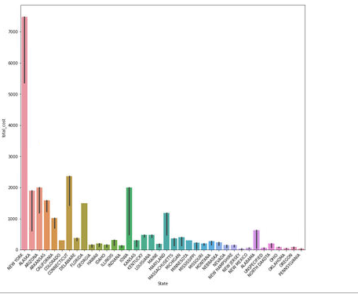

**After grouping by State, sort the data by total_cost column**

````
<copy>
sortedbyTC = df_retail.groupby('State').sum().sort_values(by='total_cost', ascending=False)
sortedbyTC.to_csv("sortedbyTC.csv")
sortedbyTC
</copy>
````

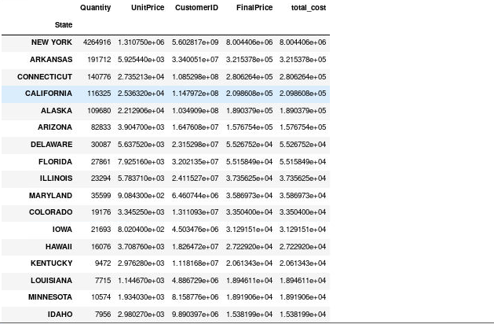

**Now we see that the largest market is located in New York.**

````
<copy>
df_retail[df_retail['State']=='NEW YORK']['CustomerID'].nunique()
</copy>
````

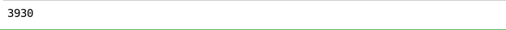

Therefore, we can conclude that most the sales revenues are realized in NEW YORK, but most the customers are located there too. This can be explored to find more about what products the customers buy together and what possible future opportunities in the NEW YORK Market.

````
<copy>
NEWYORK_retail = df_retail[df_retail['State']=='NEW YORK']
nyRetailDesc = NEWYORK_retail.describe()
nyRetailDesc.to_csv("nyRetailDesc.csv")
nyRetailDesc
</copy>
````
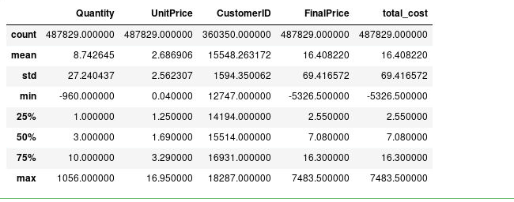

````
<copy>
print("Number of transactions: ", NEWYORK_retail['InvoiceNo'].nunique())
print("Number of products bought: ",NEWYORK_retail['StockCode'].nunique())
print("Number of customers:", NEWYORK_retail['CustomerID'].nunique() )
print("Percentage of customers NA: ", round(NEWYORK_retail['CustomerID'].isnull().sum() * 100 / len(NEWYORK_retail),2),"%" )
print('Number of states: ',NEWYORK_retail['State'].nunique())
</copy>
````

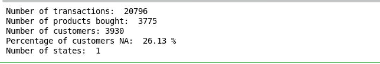

**Explore quantity**

**What are the products that are most bought in NEW YORK?**

````
<copy>
groupedProduct = NEWYORK_retail.groupby('StockCode',as_index= False)['Quantity'].sum().sort_values(by='Quantity', ascending=False)
groupedProductSorted = groupedProduct.head(10)
groupedProductSorted.to_csv("groupedProductSorted.csv")
groupedProductSorted
</copy>
````

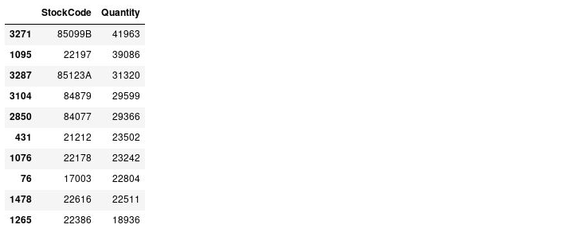

````
<copy>
invoice_quantity= NEWYORK_retail.groupby('InvoiceNo', as_index=False)['Quantity'].sum().sort_values(by='Quantity', ascending=False)
invoice_quantityHead = invoice_quantity.head()
invoice_quantityHead.to_csv("invoice_quantityHead.csv")
invoice_quantityHead
</copy>
````


