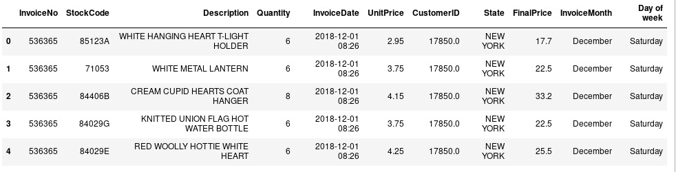
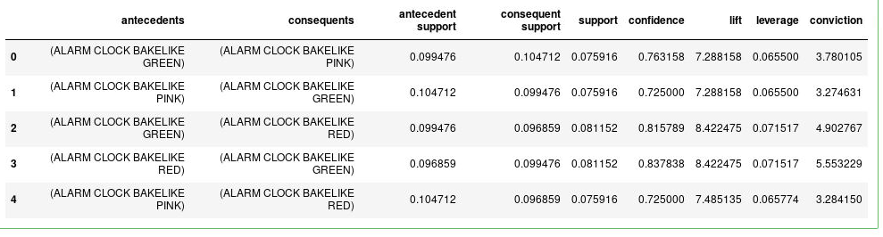
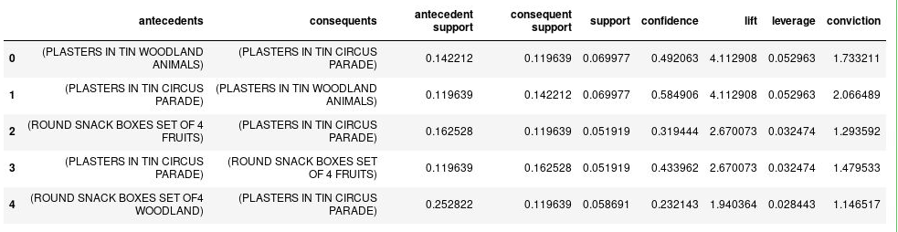
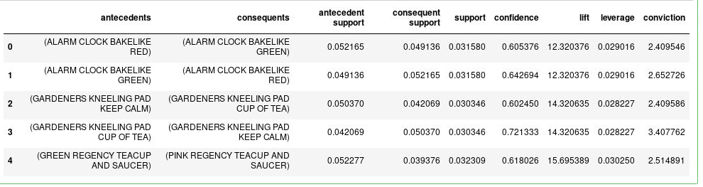
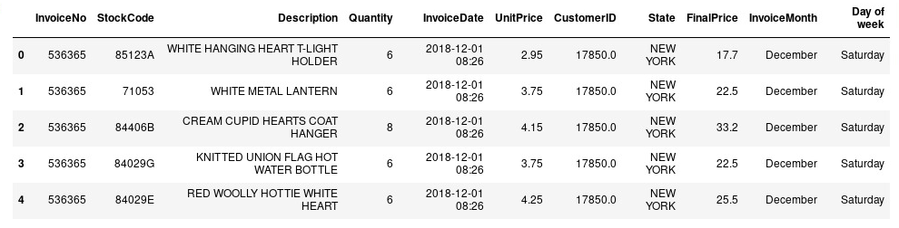
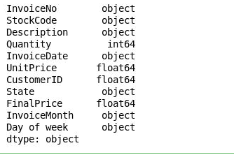
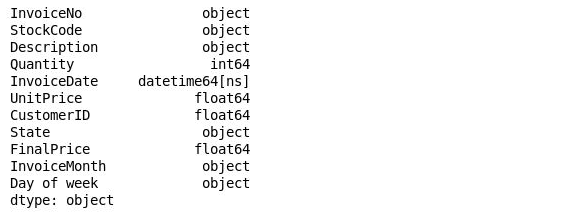
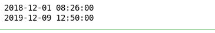
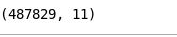
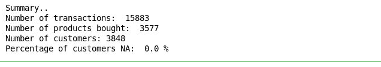

# Oracle Machine Learning 

## Introduction

YET TO GET

## Before You Begin

This lab assumes you have completed the following labs:
- Lab 1:  Login to Oracle Cloud
- Lab 2:  Generate SSH Key
- Lab 3:  Create Compute instance 
- Lab 4:  Environment setup

 
## Step 1:	Import python packages

````
<copy>
import pandas as pd
import numpy as np

import seaborn as sns
%matplotlib inline

from mlxtend.frequent_patterns import apriori
from mlxtend.frequent_patterns import association_rules
</copy>
````


## Step 2:  Load the datasets

````
<copy>
Load the datasets
</copy>
````




## Step 3:  Cleanup of the data

````
<copy>
#remove additional spaces
retail_df['Description'] = retail_df['Description'].str.strip()
#remove NA values
retail_df.dropna(axis=0, subset=['InvoiceNo'], inplace=True)
#remove cancelled orders
retail_df['InvoiceNo'] = retail_df['InvoiceNo'].astype('str')
retail_df = retail_df[~retail_df['InvoiceNo'].str.contains('C')]

</copy>
````

## Step 4: Calling the Custom python function to read XML File and save data as CSV

````
<copy>
df_cols = ["INVOICENO", "STOCKCODE", "DESCRIPTION", "QUANTITY", "INVOICEDATE", "UNITPRICE", "CUSTOMERID", "STATE"]
outDF = parse_XML("New_XML_version.xml",df_cols)
print(outDF.head())
outDF.to_csv("data_xml.csv",index=False)
</copy>
````

## Step 5:  Custom function to create statewise marketing baskets


````
<copy>
def encode_units(x):
    if x <= 0:
        return 0
    if x >= 1:
        return 1

def create_basket(state_filter):
    basket = (retail_df[retail_df['State'] == state_filter]
          .groupby(['InvoiceNo', 'Description'])['Quantity']
          .sum().unstack().reset_index().fillna(0)
          .set_index('InvoiceNo'))
    return basket
</copy>
````

## Step 6:  Creating baskets for Alaska

````
<copy>
state_filter = "ALASKA"
basket_alaska = create_basket("ALASKA")
basket_sets = basket_alaska.applymap(encode_units)
</copy>
````
````
<copy>
state_filter = "ALASKA"
basket_alaska = create_basket("ALASKA")
basket_sets = basket_alaska.applymap(encode_units)
</copy>
````

## Step 7:  Creating association rules

````
<copy>
rules = association_rules(frequent_itemsets, metric="lift", min_threshold=1.2)
association_rules_alaska = rules.head()
association_rules_alaska.to_csv("association_rules_alaska.csv")
association_rules_alaska
</copy>
````



According to the results a customer is 7 times more likely to buy a pink alarm clock bakelike than an average customer (lift) if he/she buys ALARM CLOCK BAKELIKE GREEN. This rule is "true" in 72% of the cases (confidence). This can be used as insight to recommend ALARM CLOCK BAKELIKE PINK for tthose who bought the Green one.


## Step 8:  Creating baskets for California

````
<copy>
basket_ca = create_basket("CALIFORNIA")
basket2_sets = basket_ca.applymap(encode_units)
</copy>
````

````
<copy>
frequent_itemsets_ca = apriori(basket2_sets, min_support=0.05, use_colnames=True)
</copy>
````

## Step 9:  Association rules for Alaska

````
<copy>
rules = association_rules(frequent_itemsets_ca, metric="lift", min_threshold=1.2)
association_rules_california = rules.head()
association_rules_california.to_csv("association_rules_california.csv")
association_rules_california
</copy>
````



According to the results a customer is 4 times more likely to buy PLASTERS IN TIN WOODLAND ANIMALS than an average customer (lift) if he/she buys PLASTERS IN TIN CIRCUS PARADE. This rule is "true" in 49% of the cases (confidence). This can be used as insight to recommend PLASTERS IN TIN WOODLAND ANIMALS for tthose who bought the Green one.

At this point, you may want to look at how much opportunity there is to use the popularity of one product to drive sales of another.


## Step 10:  Creating baskets for New York

````
<copy>
basket_ny = create_basket("NEW YORK")
basket3_sets = basket_ny.applymap(encode_units)
</copy>
````
## Step 11:  Association rules for New York

````
<copy>
frequent_itemsets_ny = apriori(basket3_sets, min_support=0.05, use_colnames=True)
rules = association_rules(frequent_itemsets_ny, metric="lift", min_threshold=0.8)
rules.head()
</copy>
````


As we didn't find any rules for New York customers. We will try other filters.

````
<copy>
retail_filtered = retail_df[retail_df['State']=="NEW YORK"]
</copy>
````

We add a filter to include invoices which have less than 10 items

````
<copy>
basket = (retail_filtered[retail_filtered['Quantity']<10]
          .groupby(['InvoiceNo', 'Description'])['Quantity']
          .sum().unstack().reset_index().fillna(0)
          .set_index('InvoiceNo'))
</copy>
````

````
<copy>
basket4_sets = basket.applymap(encode_units)
</copy>
````

## Step 12: Creating rules for New York with the filtered Data

````
<copy>
frequent_itemsets_ny = apriori(basket3_sets, min_support=0.03, use_colnames=True)
rules = association_rules(frequent_itemsets_ny, metric="lift", min_threshold=0.5)
rules.head()
</copy>
````



## Conclusion

We arrived to distinguich some rules related to Alaska and Clifornia Market which can be used to make recommendations for our customers, and to better understand their preferences. 

## Segmentation

1. Import modules

````
<copy>
import pandas as pd
import numpy as np

import time, warnings
import datetime as dt

#modules for predictive models
import sklearn.cluster as cluster
from sklearn.cluster import KMeans
from sklearn.decomposition import PCA
from sklearn.mixture import GaussianMixture


from sklearn.metrics import silhouette_samples, silhouette_score

#visualizations
import matplotlib.pyplot as plt
from pandas.plotting import scatter_matrix
%matplotlib inline
import seaborn as sns

warnings.filterwarnings("ignore")
</copy>
````

2. Import Data

````
<copy>
#load the dataset
CleanDataset = r'../3-Cleaned-Dataset/OnlineRetail_Cleaned_New.csv'
retail_df = pd.read_csv(CleanDataset)
retail_df.head()
</copy>
````


````
<copy>
retail_df.dtypes
</copy>
````


3. Formatting the Date/Time
````
<copy>
retail_df['InvoiceDate'] = pd.to_datetime(retail_df['InvoiceDate'], format = '%Y/%m/%d %H:%M')
</copy>
````

4. Checking data types of the attributes
````
<copy>
retail_df.dtypes
</copy>
````



5. Checking the date range with min and max functions

````
<copy>
print (retail_df['InvoiceDate'].min())
print (retail_df['InvoiceDate'].max())
</copy>
````



**Prepare the Data**

As customer clusters may vary by geography, I\u2019ll restrict the data to only New York customers, which contains most of our customers historical data.

````
<copy>
retail_ny = retail_df[retail_df['State']=='NEW YORK']
#dimension
retail_ny.shape
</copy>
````



1. Delete Canceled orders

````
<copy>
retail_ny = retail_ny[retail_ny['Quantity']>0]
retail_ny.shape
</copy>
````

2. Delete rows with missing Customer ID
````
<copy>
retail_ny.dropna(subset=['CustomerID'],how='all',inplace=True)
retail_ny.shape
</copy>
````

3.  Restrict the data to excatly one year
````
<copy>
retail_ny = retail_ny[retail_ny['InvoiceDate']>= "2018-12-09"]
retail_ny.shape
</copy>
````

4. Print Summary

````
<copy>
print("Summary..")
#exploring the unique values of each attribute
print("Number of transactions: ", retail_ny['InvoiceNo'].nunique())
print("Number of products bought: ",retail_ny['StockCode'].nunique())
print("Number of customers:", retail_ny['CustomerID'].nunique() )
print("Percentage of customers NA: ", round(retail_ny['CustomerID'].isnull().sum() * 100 / len(retail_df),2),"%" )
</copy>
````



## Acknowledgements

- **Authors** - Balasubramanian Ramamoorthy, Arvind Bhope
- **Contributors** - Laxmi Amarappanavar, Kanika Sharma, Venkata Bandaru, Ashish Kumar, Priya Dhuriya, Maniselvan K,Amit Ghosh
- **Team** - North America Database Specialists.
- **Last Updated By** - Kay Malcolm, Director, Database Product Management, June 2020
- **Expiration Date** - June 2021  

## Issues?
Please submit an issue on our [issues](https://github.com/oracle/learning-library/issues) page. We review it regularly.


