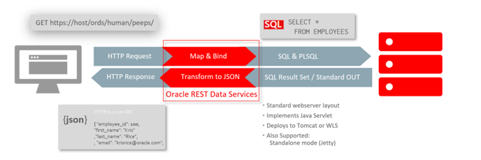
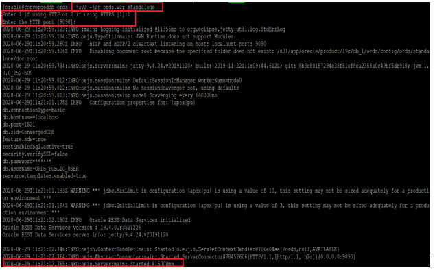
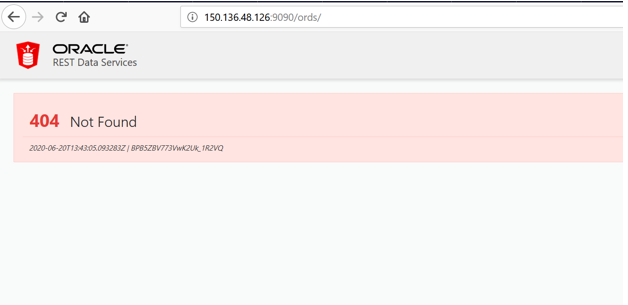

# Workshop Introduction and Overview

## Introduction to ORDS

ORDS is middle tier JAVA application that allows you to access your Oracle Database resources via REST. Use standard HTTP calls (GET|POST|PUT|DELETE|HEAD) via URIs that ORDS makes available (/ords/database123/user3/module5/something/)


ORDS will find and run the appropriate database workload (a query, an anonymous block), and return the output as formatted JSON.

 

## Install ORDS using SQL Developer

Oracle REST Data Services (ORDS) is bundled with SQL Developer. You can use SQL Developer to install the ORDS version that is bundled in SQL Developer or a standalone version.

As part of this lab , ORDS is pre-installed and ready for use.

## About RESTful Services 

Representational State Transfer (REST) is a style of software architecture for distributed hypermedia systems such as the World Wide Web. A service is described as RESTful when it conforms to the tenets of REST.  RESTful Service has the following characteristics: 

•	Data is modeled as a set of resources. Resources are identified by URIs. 

•	A small, uniform set of operations are used to manipulate resources (for example, GET, POST, PUT, DELETE). 

•	A resource can have multiple representations (for example, a blog might have a HTML representation and a RSS representation). 

•	Services are stateless and since it is likely that the client will want to access related resources, these should be identified in the representation returned, typically by providing hypertext links. 


## RESTful Services Terminology 

Common terms that are used throughout this lab: 

•	RESTful Service : An HTTP web service that conforms to the tenets of the RESTful Architectural Style, as described in "About RESTful Services" above. 

•	Resource Module : An organizational unit that is used to group related Resource Templates together. 

•	Resource Template : An individual RESTful ervice that is able to service requests for some set of URIs (Universal Resource Identifiers). The set of URIs is defined by the URI Template of the Resource Template.

•	Route Patterns: A simple grammar that defines the particular patterns of URIs that a given Resource Template can handle. For example, the pattern, employees/, will match any URI whose path begins with employees/. 

Example: http://localhost:8888/ords/hr/demo/employees/ 

•	Resource Handler : Provides the logic required to service a particular HTTP method, for a specific Resource Template. For example the logic of the GET HTTP method for the above Resource Template might be:

select empno, ename, dept from emp where empno = :id

•	HTTP Operation : HTTP (HyperText Transport Protocol) defines a number of standard methods that can be performed on resources:

o	GET : Retrieve the resource contents. 

o	POST : Store a new resource.

o	PUT : Update an existing resource. 

o	DELETE : Remove a resource. 

## Step-1: Start ORDS in standalone mode

1.	To start ORDS in standalone mode, go to your terminal and login as oracle user.

````
<copy>
sudo su – oracle
</copy>
````

````
<copy>
. oraenv
</copy>
````
````
<copy>
cd $ORACLE_HOME/ords
</copy>
````

````
<copy>
java -jar ords.war standalone
</copy>
````

Enter 1 if using HTTP or 2 if using HTTPS [1]:1

Enter the HTTP port [9090]:9090

In the below snippet notice the bottom red highlighted part which shows that ORDS is started.

 

2.	We need to use nohup command for starting the ORDS  because in interactive mode the process is stopped when we quit the terminal. So quit ORDS process now and restart it in nohup mode as below-

Ctrl+c

````
<copy>
nohup java -jar ords.war standalone &
</copy>
````

Enter


## Step-2: Check if ORDS is connecting through the browser

Open the browser and enter the following URI in the address bar:

````
http://<Instance_public_ip>:9090/ords/
````

If you see ORACLE REST DATA SERVICES 404 Not Found, it means that ORDS is connected. 

 

## ORDS Video
  
  [](youtube:rvxTbTuUm5k)
  

## Want to learn more
- [ORDS](https://www.oracle.com/in/database/technologies/appdev/rest.html)

## Acknowledgements

- **Authors** - Balasubramanian Ramamoorthy, Arvind Bhope
- **Contributors** - Laxmi Amarappanavar, Kanika Sharma, Venkata Bandaru, Ashish Kumar, Priya Dhuriya, Maniselvan K.
- **Team** - North America Database Specialists.
- **Last Updated By** - Kay Malcolm, Director, Database Product Management, June 2020
- **Expiration Date** - June 2021   

**Issues-**
Please submit an issue on our [issues](https://github.com/oracle/learning-library/issues) page. We review it regularly.
      

