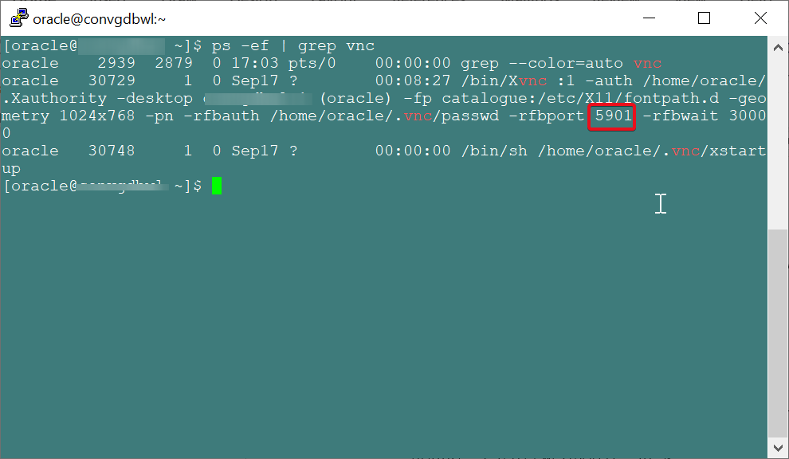
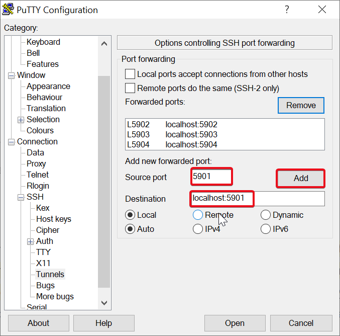
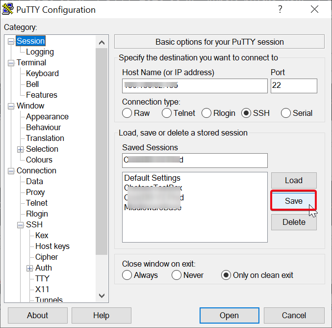

# Start Services

## Introduction

This lab will show you how to setup tunneling for VNC, start VNC Server and connect to remote VNC session. Also, this lab will show steps to start the database instance, listener, Weblogic server and JDeveloper IDE. In this lab we will also import the eSHOP JEE Code to JDeveloper IDE.

*Estimated Lab Time:* 30 Minutes

### Objectives
- Start VNC Server
- Configure Tunneling for VNC access
- Download & Install VNC Client OR use Chrome VNC Plugin
- Connect to remote VNC Server
- Start the Oracle Database and Listener
- Start Weblogic Server

### Prerequisites
This lab assumes you have completed the following labs:
- Lab 1: Generate SSH Key - Cloud Shell
- Lab 2: Setup Compute Instancecd 

## **STEP 1**: Login to ConvergedDB Compute instance

If you aren't already logged in, follow the steps below to login. If you are logged in, skip to Step 2.

1. Click the Hamburger Menu in the top left corner. Then hover over Compute > Instances. Find the instance you created in the previous lab.

    
    


2. Click on your instance and copy your Public IP address to a notepad.

   
    


3. In Oracle Cloud Shell (*recommended*) or the terminal of your choice, login via ssh as the **opc** user. 


      ````
      ssh -i <<sshkeylocation>> opc@<<your address>>
      ````

      - sshkeylocation - Full path of your SSH key
      - your address - Your Public IP Address


## **STEP 2**: Start the Database and the Listener


1. Switch to the oracle user
      ````
      <copy>sudo su - oracle</copy>
      ````

   


2.  Run the script env\_setup\_script.sh, this will start the database, listener, oracle rest data service and our eshop application. This script could take 2-5 minutes to run.


      ````
      <copy>cd /u01/script
      ./env_setup_script.sh</copy>
      ````


   


## **STEP 3**: Start the WebLogic service and VNC Service

1. Switch to the oracle user
      ````
      <copy>sudo su - oracle</copy>
      ````

2.	As oracle user run the setWLS14Profile.sh script.  This will setup the environment variables needed to start the WebLogic 14c Services.


    ````
    <copy>cd /u01/middleware_demo/scripts/
    . ./setWLS14Profile.sh
    cd $DOMAIN_HOME/bin</copy>
    ````


3.	As oracle user run startWebLogic.sh script. This will start the WebLogic services


    ````
    <copy>
        nohup ./startWebLogic.sh &
    </copy>
    ````

4.	Start VNC server service on the host by using the command below 

    ````
    <copy>
        vncserver
    </copy>
    ````

5.	Once the vnc services start command completes, Verify and note down the port on which VNC services are running


    ````
    <copy>
        ps -ef | grep vnc
    </copy>
    ````

    


## **STEP 4**: Setup PuTTY


**Save Private Key from CloudShell**

1.	Exit as all users to be back in your cloudshell.
2.	At the cloud shell prompt, use the cat command.

    ````
    cat ~/.ssh/<sshkeyname>
    ````
3.	Copy the text output without line breaks and carriage returns from the cloudshell console.
4.	Save the text in your text editor locally as <<sshkeyname>>.privatekey.

## **STEP 5**: Tunneling in PuTTY

**On Windows**
    
1. Perform steps under Windows Using Putty under Step 4: Connect to your instance in lab 2
2. In the left-hand side nav tree, click Connection > SSH > Tunnels
3. Enter the port that you noted down while verifying VNC service under Source port. Then supply the destination address as Destination as shown in the following image.

  
    


4. Click on Session on left hand side menu and Save the session


    


**On Mac**

1. Use command below

    ````
        
        ssh -N -L <port>:localhost:<port> <Public_IP>
        
    ````

2.	Keep the terminal open during the entire workshop session


## **STEP 6**: Install VNC Client and Connect

1. You need to have an SSH session or PuTTY session as Oracle user running
2. Download and Install VNC Client like TigerVNC viewer from [TigerVNC Portal](https://tigervnc.org/) OR RealVNC from [RealVNC Portal](https://www.realvnc.com/en/connect/download/viewer/)
3. If you have Chrome browser, add VNC Viewer from this [link](https://chrome.google.com/webstore/detail/vnc%C2%AE-viewer-for-google-ch/iabmpiboiopbgfabjmgeedhcmjenhbla)  
4. Open Chrome apps and Install Extension on Chrome
5. Launch VNC Viewer / RealVNC
6. Enter localhost:<port\> and connect
7. Provide **vncserver** as password
8. Your VNC session will open in a new window


## Summary
In summary, you have successfully accessed the VNC console of the lab system and started all required services to walk through the labs.

You may now *proceed to the next lab*.


## Acknowledgements
- **Authors** - Pradeep Chandramouli, Nishant Kaushik, Kanika Sharma, Laxmi Amarappanavar, Balasubramanian Ramamoorthy, AppDev & Database Team, Oracle, October 2020
- **Contributors** - Meghana Banka, Rene Fontcha
- **Last Updated By/Date** - Kanika Sharma, NA Technology, October 2020

## Need Help?
Please submit feedback or ask for help using our [LiveLabs Support Forum](https://community.oracle.com/tech/developers/categories/livelabsdiscussions). Please click the **Log In** button and login using your Oracle Account. Click the **Ask A Question** button to the left to start a *New Discussion* or *Ask a Question*.  Please include your workshop name and lab name.  You can also include screenshots and attach files.  Engage directly with the author of the workshop.

If you do not have an Oracle Account, click [here](https://profile.oracle.com/myprofile/account/create-account.jspx) to create one.


        


