# Oracle Weblogic
  
   
## Introduction

This lab walks you through creation of datasource on weblogic UI and use the feature of weblogic administration console to record the actions as WLST script and use it as a re-usable asset to create multiple datasources in future.

Handling database connections using weblogic datasources gives the developers freedom to configure database related performance parameters on the weblogic side rather than tweaking the application code. 

•	It improves application performance as connections are not created/closed within a class, they are managed by the application server and can be fetched while at runtime.

•	It provides a facility for creating a pool of connections

•	Recycling of connections in the pool is helpful for enterprise application 

•	It supports distributed transactions

JEE standards on weblogic helps register datasources in JNDI out of the box for better compliant programming


## Before You Begin

**What Do You Need?**

This lab assumes you have completed the following labs:
- Lab 1: Login to Oracle Cloud
- Lab 2: Generate SSH Key
- Env Setup: WebLogic Environment setup
- All steps of DB and WLS service start till before


## Step 1: Login to WLS Console & Setup WLST Recording options
   
•	Open the firefox browser and navigate to http://localhost:7101/console

•	Login as weblogic/Oracle123!

•	You will be connected to the admin server in the wl_domain domain where we are executing this lab

•	Click on “Preferences”

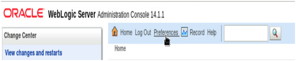

•	Click on “WLST Script Recording”

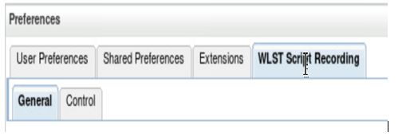

•	Change the “Base Script Directory “ to “/u01/middleware_demo/scripts” and “Script file name” to “createDS.py”

•	Click on “Save

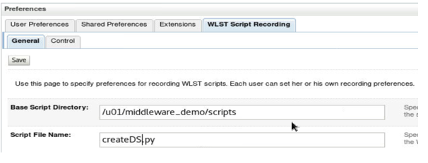

•	Click on “Control” tab.  Click “Start Recording”


## Step 2: Create the JSON/XML datasource and record it

    
•	Navigate to Weblogic Administrator console on browser if already open else, open a browser and navigate to http://localhost:7101/console and login as weblogic/Oracle123!

•	Under “Domain Structure” tab on left hand side, expand “Services”, Click on “Data Sources”.  Click on “New” and select “Generic Data Source”

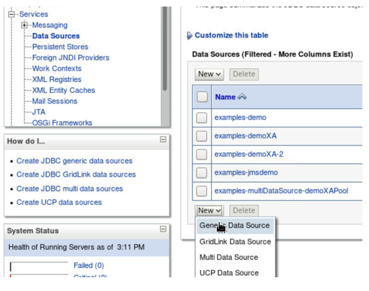

•	Enter Name as “jsonxmlds”, enter JNDI Name as “jndi/jsonxmlds” and select “Oracle” for “Database Type”

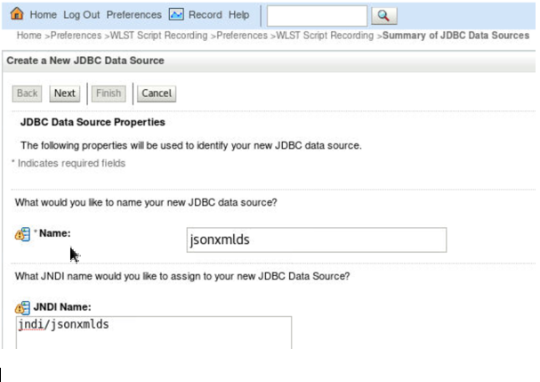

•	Click Next

•	Choose the Database Driver. Select “*Oracle’s Driver (Thin) for Service Connections; Versions:Any”

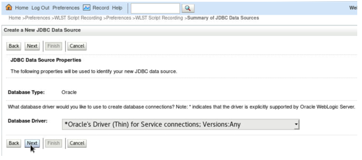

•	Click Next

•	Select “Supports Global Transactions”. Click Next.  Read all other options

•	Select “One Phase Commit”, Click Next

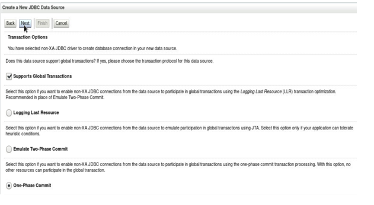

•	Under Connection Properties Screen, provide the following values:

  o	Database Name: JXLPDB

  o	 Host Name: localhost

  o	Port: 1521

  o	Database User Name: appjson

  o	Password & Confirm Password: Oracle_4U

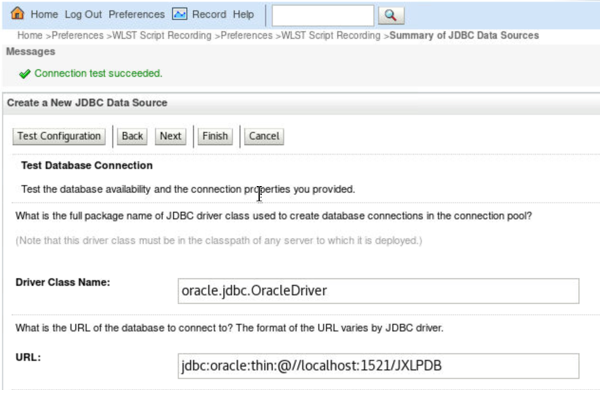

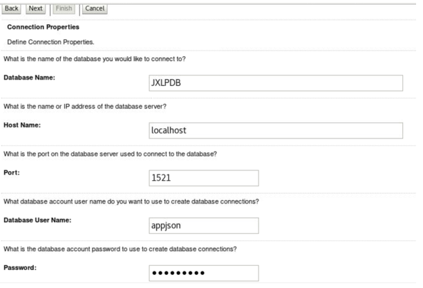

•	Click Next

•	Click on “Test Connection” button.  Once the connection is successful., Click Next

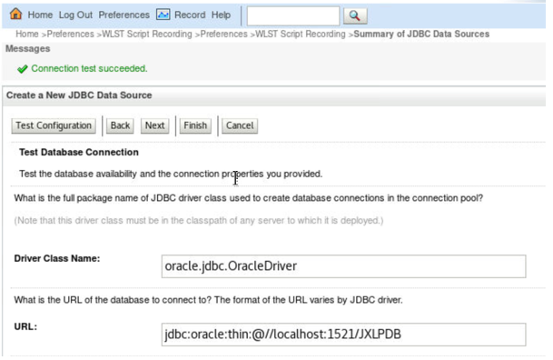

•	Click Next

•	To assign the data source to the required server, under “Select Targets”, select the “Admin Server” check box to assign the datasource to AdminServer. Click Finish


•	On the top URL links, again click on “Preferences”, click “WLST Script Recording”, and under “Control” tab, click “Stop Recording”

•	You will see the wlst functions and commands auto-generated in the text area.  A copy of same it saved as createDS.py under /u01/middleware_demo/scripts


## Step 3: Modify the recorded wlst to create Spatial/Graph datasource

In this step we will edit the recorded script a little to connect to the required AdminServer, change the parameters like data source name, other connection parameters and execute the script from command line.

•	Open the recorded createDS.py using gedit editor

•	gedit /u01/middleware_demo/scripts/createDS.py

•	Make sure the following 3 lines are the first 3 lines of the file

````
<copy>
connect(‘weblogic’,’Oracle123!’,’t3://localhost:7101’)
edit()
startEdit()
</copy>
````

•	Remove the line with keyword “setEncrypted(“ or comment it by adding “//” as the first two characters at the line before the keyword “setEncrypted”

````
<copy>
//setEncrypted('Password', 'Password_1592840128546', '/u01/middleware_demo/scripts/createDSConfig', '/u01/middleware_demo/scripts/createDSSecret')
</copy>
````

•	Instead of the above line, we can set the password for the datasource connection using the setPassword() command in the wlst.  Write the below line in place of line containing “setEncrypted”

````
<copy>
cmo.setPassword(“Oracle_4U”)
</copy>
````

•	Click on the “Menu” icon on the right hand side of the gedit window.  Click “Find and Replace” option 

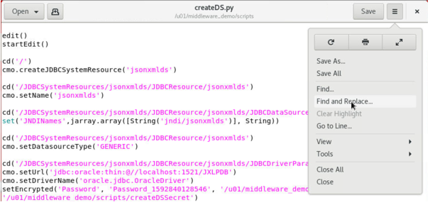

•	Find and replace all occurrence of “jsonxmlds” with “spatialgraphds”

•	Find and replace “JXLPDB” with “SGRPDB”

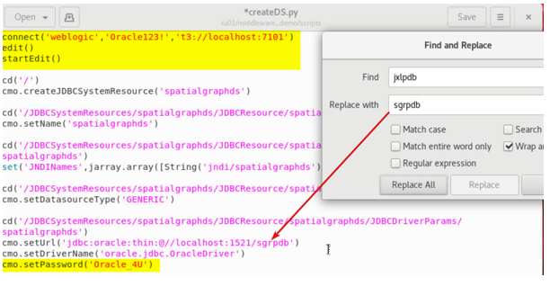

•	Find and replace the username for database connection “appjson” with “appspat”

•	Make sure the last 3 lines of the script be as below:

````
<copy>
save()
activate()
exit()
</copy>
````

•	Click “Save” in gedit and close


## Step 4: Run WLST script to create Spatial/Graph datasource & Verify on admin console

•	Navigate to folder where the edited datasource create script exits

````
<copy>
cd /u01/middleware_demo/scripts
</copy>
````

•	Source the lab profile file

````
<copy>
. /u01/middleware_demo/scripts/setWLS14Profile.sh (DOT Space PATH)
</copy>
````

•	Source the setDomainEnv.sh

````
<copy>
sh $DOMAIN_HOME/bin/setDomainEnv.sh
</copy>
````

•	Execute the java command below to run the WLST script to create the second datasource “spatialgraphds”

````
<copy>
java weblogic.WLST createDS.py
</copy>
````

•	Navigate back to weblogic admin console and click on “Data Sources” under “Services”

•	You will observe that the new datasource “spatialgraphds” is created.

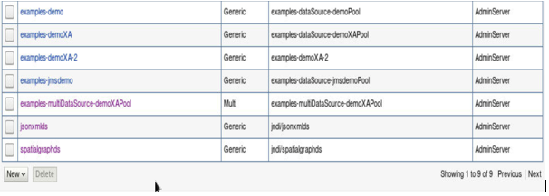


## Step 5: Create Data Source for eShop application

•	Navigate to folder where the edited datasource create script exits

````
<copy>
cd /u01/middleware_demo/scripts
</copy>
````

•	Source the lab profile file

````
<copy>
. /u01/middleware_demo/scripts/setWLS14Profile.sh (DOT Space PATH)
</copy>
````

•	Source the setDomainEnv.sh

````
<copy>
sh $DOMAIN_HOME/bin/setDomainEnv.sh
</copy>
````

•	Import the eShop application code from git repository. Navigate to the utilities folder and execute the python scripts needed to create datasources needed for eShop application

````
<copy>
cd /u01/middleware_demo
</copy>

````
````
<copy>
git clone https://url_to_be_decided_soon

cd converge-java/utilities
</copy>
````

•	Execute the two WLST python scripts to create two datasources

````
<copy>
java weblogic.WLST createAppDataSourceJXL.py

java weblogic.WLST createAppDataSourceSGR.py

</copy>
````

•	Navigate back to weblogic admin console and click on “Data Sources” under “Services”

•	You will observe that the new datasources “datasource_jsonXml” and “datasource_spatialAnalytics” are created

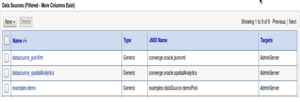


## Acknowledgements

- **Authors** - Balasubramanian Ramamoorthy, Dhananjay Kumar, Pradeep Chandramouli
- **Contributors** - Nishanth Kaushik,Kanika Sharma,Srinivas Pothukuchi,Arvind Bhope
- **Team** - North America AppDev Specialists
- **Last Updated By** - Kay Malcolm, Director, Database Product Management, June 2021
- **Expiration Date** - June 2021


## Issues?
Please submit an issue on our [issues](https://github.com/oracle/learning-library/issues) page. We review it regularly.

      