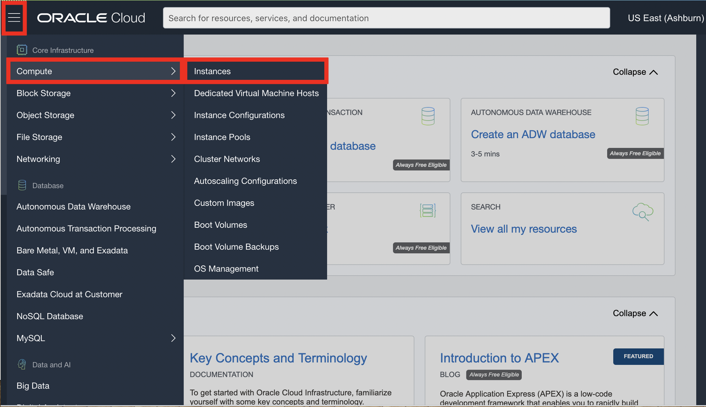
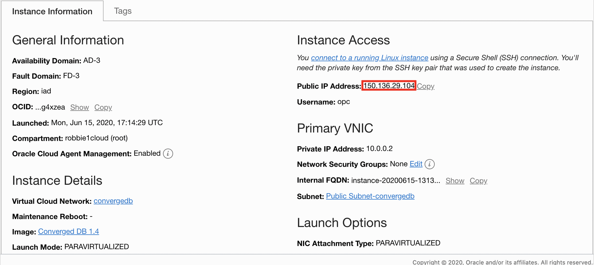
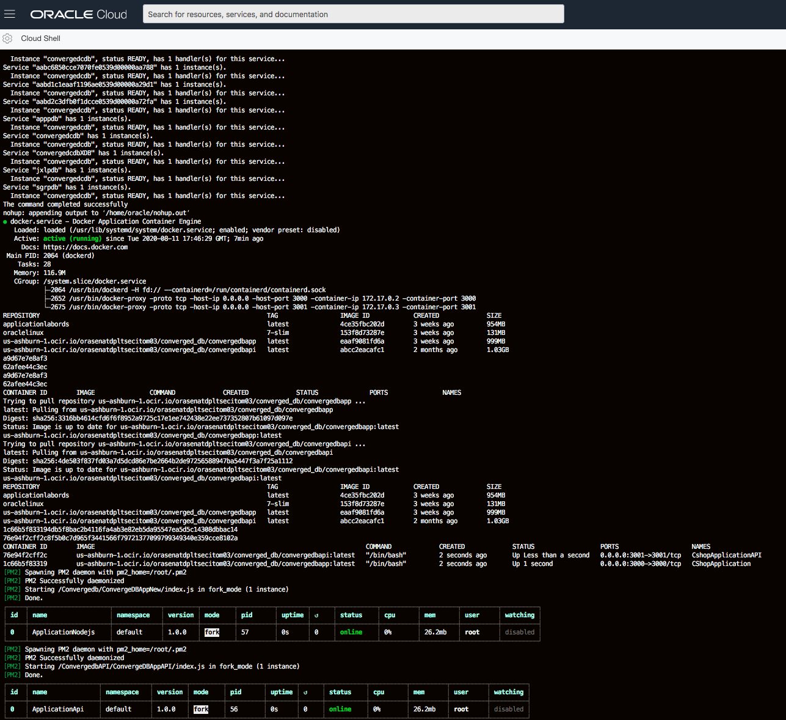
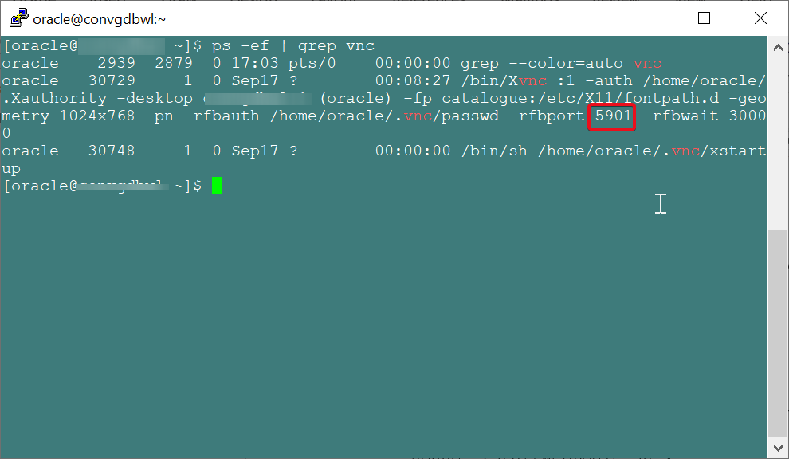
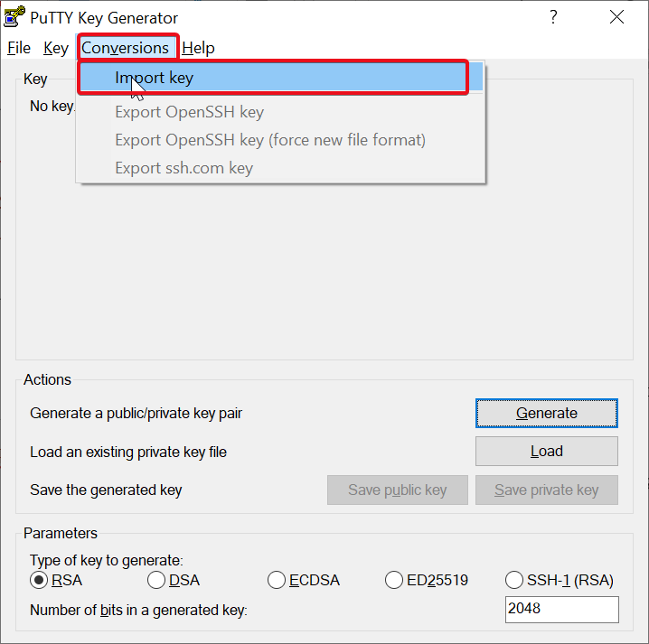
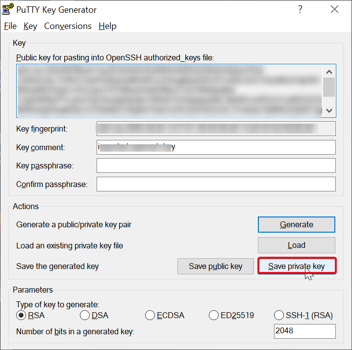
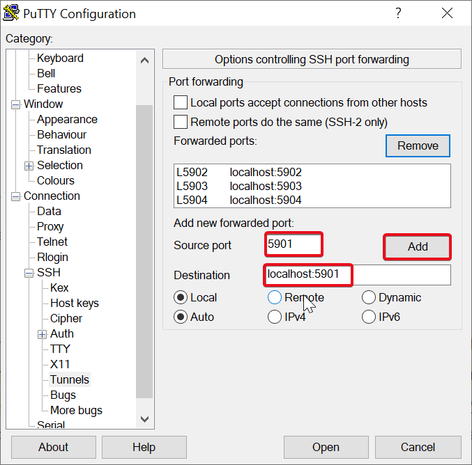
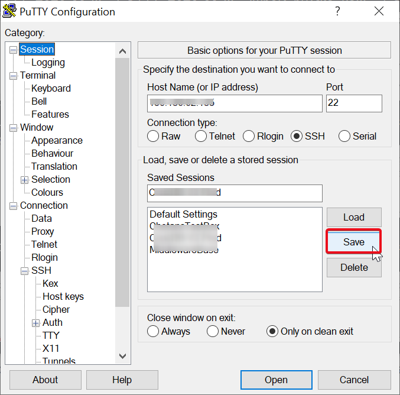

# Start Services

## Introduction

This lab will show you how to setup tunneling for VNC, start VNC Server and connect to remote VNC session. Also, this lab will show steps to start the database instance, listener, Weblogic server and JDeveloper IDE. In this lab we will also import the eSHOP JEE Code to JDeveloper IDE.

**Estimated Time:** 30 Minutes


### Objectives

- Start VNC Server
- Configure Tunneling for VNC access
- Download & Install VNC Client OR use Chrome VNC Plugin
- Connect to remote VNC Server
- Start the Oracle Database and Listener
- Start Weblogic Server

### Pre-requisits

This lab assumes you have completed the following labs:
- Lab 1: Generate SSH Key - Cloud Shell
- Lab 2: Setup Compute Instance

## **Step 1:** Login to ConvergedDB Compute instance

If you aren't already logged in, follow the steps below to login. If you are logged in, skip to Step 2.

1. Click the Hamburger Menu in the top left corner. Then hover over Compute > Instances. Find the instance you created in the previous lab.

    
    


2. Click on your instance and copy your Public IP address to a notepad.

   
    


3. In Oracle Cloud Shell (*recommended*) or the terminal of your choice, login via ssh as the **opc** user. 


      ````
      ssh -i <<sshkeylocation>> opc@<<your address>>
      ````

      - sshkeylocation - Full path of your SSH key
      - your address - Your Public IP Address


## **Step 2:** Start the Database and the Listener


1. Switch to the oracle user
      ````
      <copy>sudo su - oracle</copy>
      ````

   


2.  Run the script env\_setup\_script.sh, this will start the database, listener, oracle rest data service and our eshop application. This script could take 2-5 minutes to run.


      ````
      <copy>cd /u01/script
      ./env_setup_script.sh</copy>
      ````


   


## **Step 3:** Start the WebLogic service and VNC Service

1. Switch to the oracle user
      ````
      <copy>sudo su - oracle</copy>
      ````

2.	As oracle user run the setWLS14Profile.sh script.  This will setup the environment variables needed to start the WebLogic 14c Services.


    ````
    <copy>cd /u01/middleware_demo/scripts/
    . ./setWLS14Profile.sh
    cd $DOMAIN_HOME/bin</copy>
    ````


3.	As oracle user run startWebLogic.sh script. This will start the WebLogic services


    ````
    <copy>
        nohup ./startWebLogic.sh &
    </copy>
    ````

4.	Start VNC server service on the host by using the command below 

    ````
    <copy>
        vncserver
    </copy>
    ````

5.	Once the vnc services start command completes, Verify and note down the port on which VNC services are running


    ````
    <copy>
        ps -ef | grep vnc
    </copy>
    ````

    


## **Step 4:** Setup PuTTY


**Save Private Key from CloudShell**

1.	Exit as all users to be back in your cloudshell.
2.	At the cloud shell prompt, use the cat command.

    ````
    cat ~/.ssh/<sshkeyname>
    ````
3.	Copy the text output without line breaks and carriage returns from the cloudshell console.
4.	Save the text in your text editor locally as <<sshkeyname>>.privatekey.

## **Step 5:** Install PuTTygen and Generate .PPK file

1.	Download and install PuTTYgen from https://www.puttygen.com/ based on your OS
2.	Generate the .PPK file as below:

    **For Windows**

    * Open PuTTYgen tool
    * Click on Conversions, Click Import Key

        

    * Select the .privatekey file saved Step 4 above
    * Provide the same Key Passphrase and Confirm Passphrase given while generating the keys as in Lab 1.
    * Click on Save Private Key button and save as .ppk file to use it later in PuTTY tool to connect to the instance.

        

    **For MAC**
    
    * Install on MAC using any of the commands

        Using HomeBrew

        ````   
        <copy>
            sudo brew install putty
        </copy>
        ````

        Using MaCPorts

        ````
        <copy>
            sudo port install putty
        </copy>
        ````
         
    * To convert the private key to standard PEM format, type the following command.
        ````
        <copy>
            puttygen <filename>.privatekey -O private -P <passphrase> -o <filename>.ppk
        </copy>
        ````
    **For LINUX**
    
    * Install on Linux using the command below
        ````
        <copy>
            sudo apt install putty-tools
        </copy>
        ````

        OR

        ````
        <copy>
            yum install putty-tools
        </copy>
        ````
    * We do not need a .ppk file to connect in Linux environments.  Saved <filename>.privatekey in OpenSSH format can be used to connect to workshop system over ssh.

## **Step 6:** Tunneling in PuTTY

**On Windows**
    
1. Perform steps under Windows Using Putty under Step 4: Connect to your instance in lab 2
2. In the left-hand side nav tree, click Connection > SSH > Tunnels
3. Enter the port that you noted down while verifying VNC service under Source port. Then supply the destination address as Destination as shown in the following image.

  
    


4. Click on Session on left hand side menu and Save the session


    


**On Mac**

1. Use command below

    ````
        <copy>
            ssh -N -L <port>:localhost:<port> <Public_IP>
        </copy>
    ````

2.	Keep the terminal open during the entire workshop session


## **Step 7:** Install VNC Client and Connect

1. You need to have an SSH session or PuTTY session as Oracle user running
2. Download and Install VNC Client like TigerVNC viewer from https://tigervnc.org/ and RealVNC from https://www.realvnc.com/en/connect/download/viewer/ 
3. If you have Chrome browser, add VNC Viewer from the link https://chrome.google.com/webstore/detail/vnc%C2%AE-viewer-for-google-ch/iabmpiboiopbgfabjmgeedhcmjenhbla  
4. Open Chrome apps and Install Extension on Chrome
5. Launch VNC Viewer / RealVNC
6. Enter localhost:<port> and connect
7. Provide vncserver as password  
8. Your VNC session will open in a new window


## Acknowledgements

- **Authors** - Pradeep Chandramouli, Nishant Kaushik
- **Contributors** - - Laxmi Amarappanavar, Kanika Sharma, Balasubramanian Ramamoorthy, Nishant Kaushik
- **Team** - 
- **Last Updated By** - 
- **Expiration Date** -    

## See an issue?
Please submit feedback using this 
[form](https://apexapps.oracle.com/pls/apex/f?p=133:1:::::P1_FEEDBACK:1)  
Please include the *workshop name*, *lab* and *step* in your request.  If you don't see the workshop name listed, please enter it manually. If you would like for us to follow up with you, enter your email in the *Feedback Comments* section.


        


