# eSHOP Application 

## Introduction

This lab will show how to create a datasource in WebLogic and will be recoding the steps for automation. We will also deploy the eSHOP application from JDeveloper to WebLogic server and verify the eSHOP application functionality.

Estimated Time: 45 Minutes

## Prerequisites

• Lab 1: Generate SSH Key - Cloud Shell 

• Lab 2: Setup Compute Instance

• Lab 3: Start Services


## Step 1: Access the WebLogic Admin Console

Handling database connections using WebLogic datasources gives the developers freedom to configure database related performance parameters on the WebLogic side rather than tweaking the application code. 

It improves application performance as connections are not created/closed within a class, they are managed by the application server and can be fetched while at runtime.it provides a facility for creating a pool of connectionsrecycling of connections in the pool is helpful for enterprise application performanceIt supports distributed transactions

1. Open the Firefox browser and navigate to http://localhost:7101/console. OR You can use the bookmark **Oracle Weblogic Server Administration Console** under **ConvergedDB-Workshp in Bookmark Toolbar** 

2. Login with below credentials:

 - Username:  weblogic

 - Password:  Oracle123!

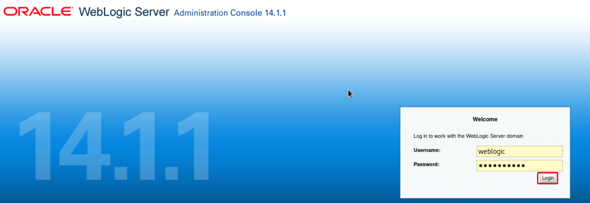


## Step 2: Configure datasource recoding

1. Click on **Preferences**

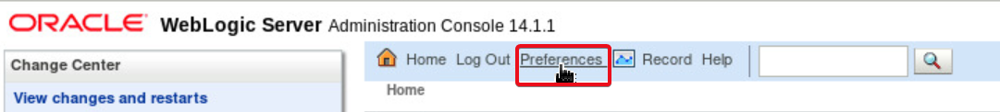

2. Click on **WLST Script Recording** tab. Under **General** tab, edit the values for parameters as 

- Base Script Directory: /u01/middleware_demo/scriptsScript

- File Name: createDS.py

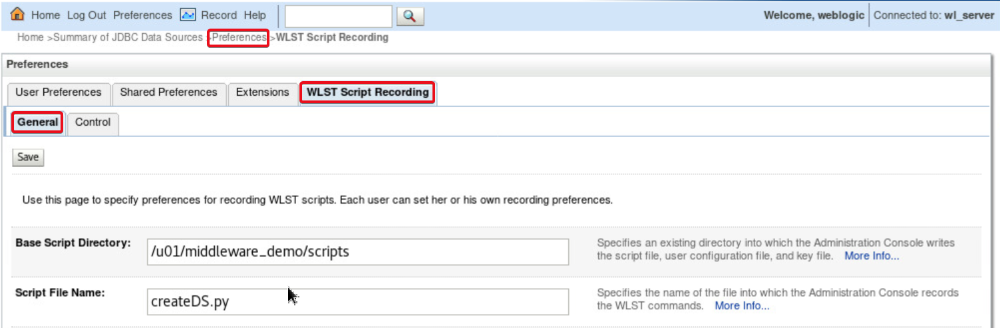

3. Scroll down, Select the CheckBox **Generate Prescript and Postscript**.  

Fill the values given below in respective textareas

Prescript Text:
````
<copy>
connect(‘weblogic’,’Oracle123!?,’t3://localhost:7101’)edit()startEdit()
</copy>
````

Postscript Text:
````
<copy>
save()

activate()

exit()
</copy>
````
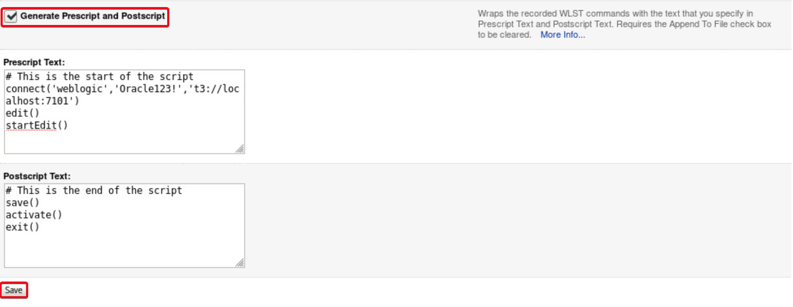

4. Click on **Save** button

5. Click on **Control** tab.  Click Start **Recording**


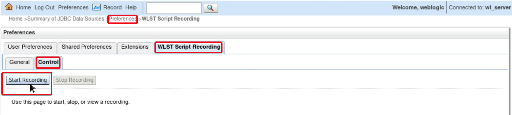


## Step 3: Create a datasource using WebLogic console

1. Under **Domain Structure** tab on left hand side, expand **Service**

2. Click on **Data Sources**  Click on New and select **Generic Data Source**

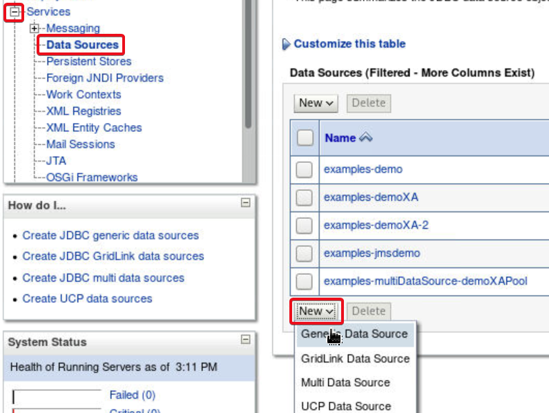

3. Fill the values as below and click **Next** button

Name: jsonxmlds

JNDI Name: convergeddb.jsonxmlds

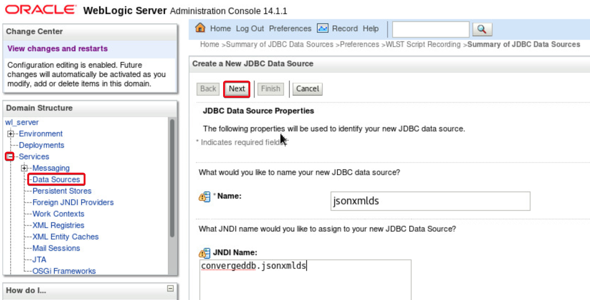

4. For **Database Driver** select the default value of **Oralce’s Driver (Thin) for Service Connections; Versions: Any.** Click **Next**

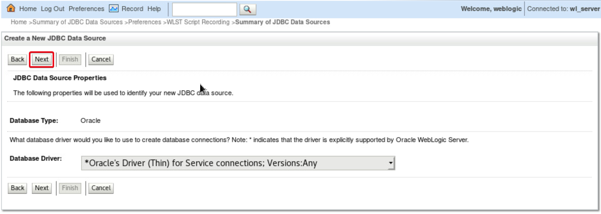

5. In the next screen do not change any values.  Let the default selections prevail.  Click **Next**

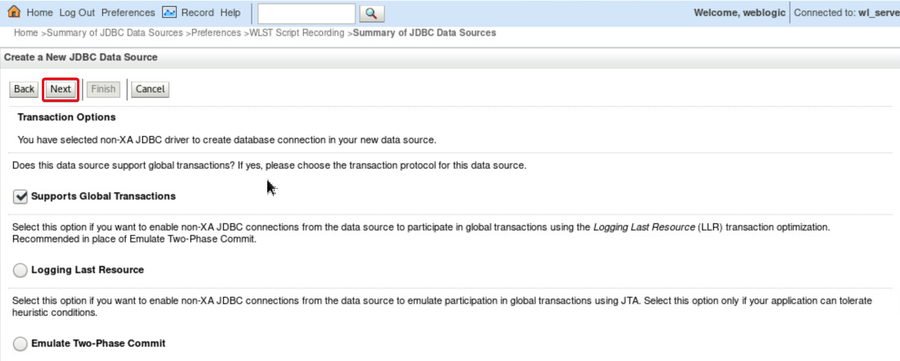

6. Under the **Connection Properties** screen provide the following values. Click **Next** 

- Database Name: JXLPDB

- Host Name: localhost

- Port: 1521

- Database User Name: appxml

- Password: Oracle_4U

- Confirm Password: Oracle_4U

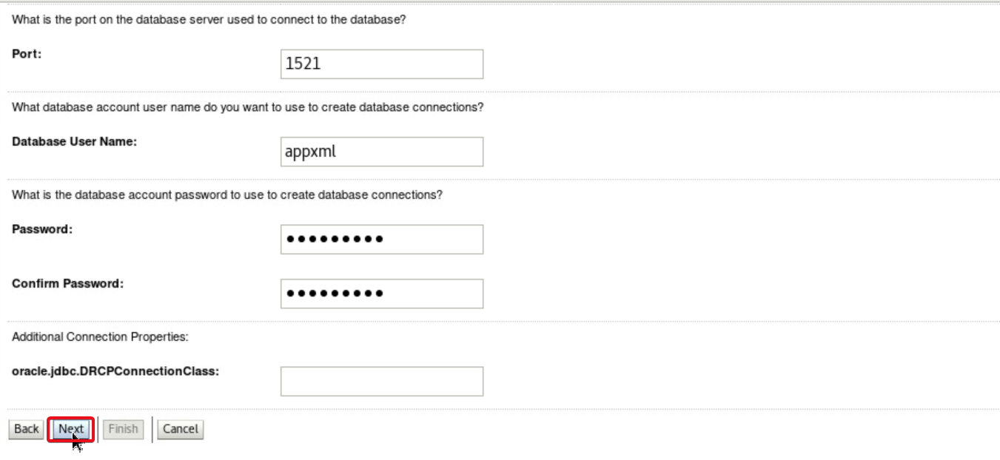

7. Click on **Test Configurtion** to confirm the connection.  Once you see a successful connection, Click **Next**

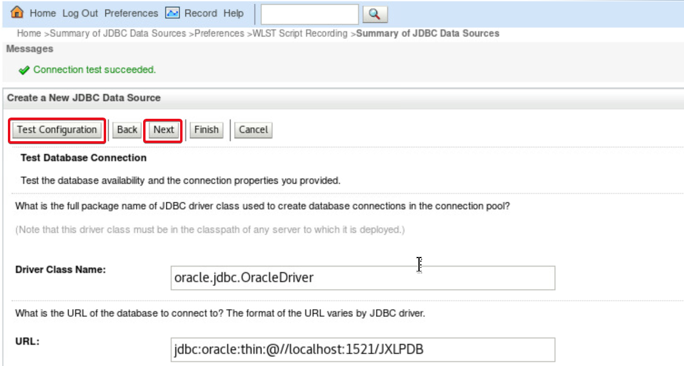

8. In the **Select Target** screen, select the checkbox against **AdminServer**. Click **Finish**

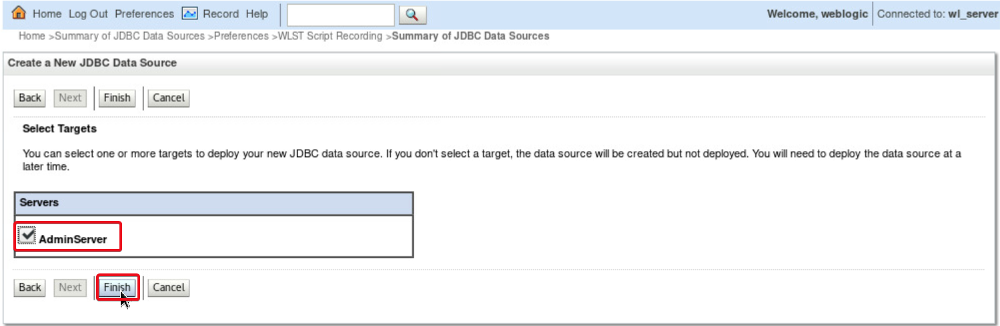

9. Navigate back to **Preferences**, **WLST Script Recording** tab. Click **Control** tab. Click on **Stop Recording** button

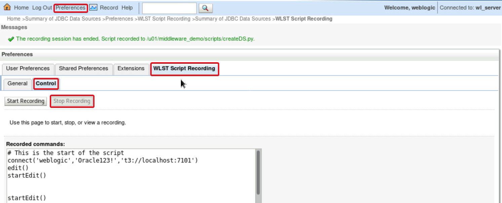

Now we have successfully recorded how a datasource can be created from WebLogic Admin Console

## Step 4: Edit the recorded script for creating another datasource

WebLogic Scripting tool is used to do all administrative actions which can be done using administrative console on a command prompt.

In this step we will edit the recorded script a little to connect to the required AdminServer, change the parameters like data source name, other connection parameters and execute the script from command line.

1. Open a **Terminal** in the VNC desktop.
   
2. Edit the recorded commands in /u01/middleware_demo/scripts/createDS.py using the command

````
<copy>
gedit /u01/middleware_demo/scripts/createDS.py
</copy>
````

3. Remove the line with keyword **setEncrypted**( or comment it by adding **#** as the first character of the line - before the keyword **setEncrypted**

````
<copy>
#setEncrypted('Password', 'Password_1592840128546',
'/u01/middleware_demo/scripts/createDSConfig',
'/u01/middleware_demo/scripts/createDSSecret')
</copy>
````

4. Instead of setEncrypted() function, we can set the password for the datasource connection using the setPassword() command in WLST.  Write the below line in place of line containing **setEncrypted** 

````
<copy>
cmo.setPassword(**Oracle_4U**)
</copy>
````

5. Click on the **Menu** icon on the right hand side of the gedit window.  Click **Find and Replace** option

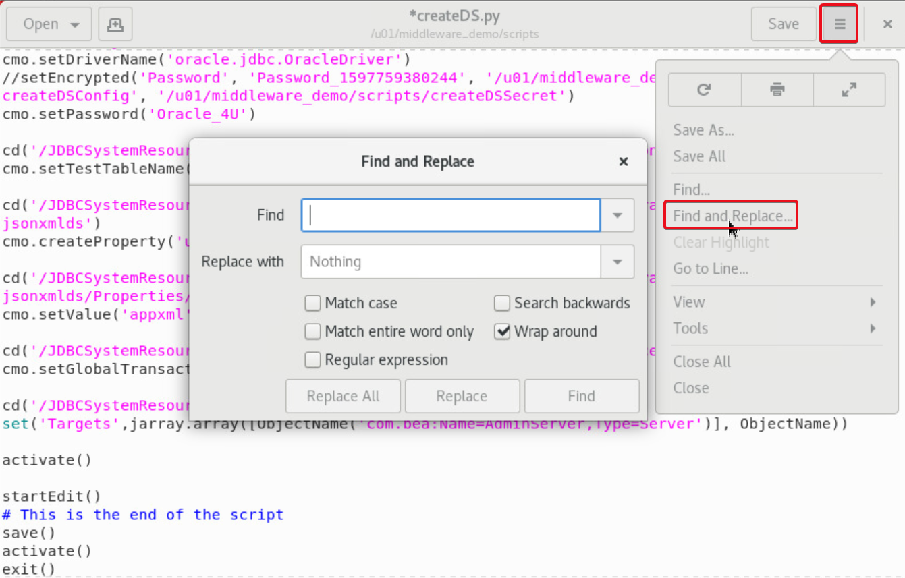

6. Find and Replace all occurrence of **jsonxmlds** with **spatialgraphds**

7. Find and Replace the username for database connection **appxml** with **appspat**

8. Find and Replace the PDB name **JXLPDB** with **SGRPDB**

9. Click **Save** button and **Close** gedit window

## Step 5: Use WLST for creating eSHOP datasources

1. Use the existing **Terminal**  or Open a new **Terminal** on VNC desktop to execute commands 
  
2. Navigate to folder where the edited datasource create script exits

````
<copy>
cd /u01/middleware_demo/scripts
</copy>
````

3. Source the lab profile file (DOT SPACE PATH)

````
<copy>
. /u01/middleware_demo/scripts/setWLS14Profile.sh
</copy>
````

4. Source the setDomainEnv.sh to set all WebLogic and WLST paths

````
<copy>
sh $DOMAIN_HOME/bin/setDomainEnv.sh
</copy>
````

5. Execute the java command below to run the WLST script to create the second datasource **spatialgraphds**

````
<copy>
java weblogic.WLST createDS.py
</copy>
````

6. Navigate to folder /u01/middleware_demo/converge-java/utilities

````
<copy>
cd /u01/middleware_demo/converge-java/utilities
</copy>
````

7. Execute the java command below to run the WLST script to create datasource connecting to PDB apppdb where the eShop data is stored

````
<copy>
java weblogic.WLST createAppDataSourceSGR.py

java weblogic.WLST createAppDataSourceJXL.py
</copy>
````

## Step 6: Deploy eSHOP Application

1. Click on the **Coffee Cup** Icon of **Oracle JDeveloper** 12c on the VNC desktop to open the Oracle JDeveloper IDE

2. When prompted for **Select Role**, opt for **Studio Developer** Role and Click **OK** button. 
  
This role has access to all features of JDeveloper.  We need it for accessing different kind of project templates to build the eSHOP application

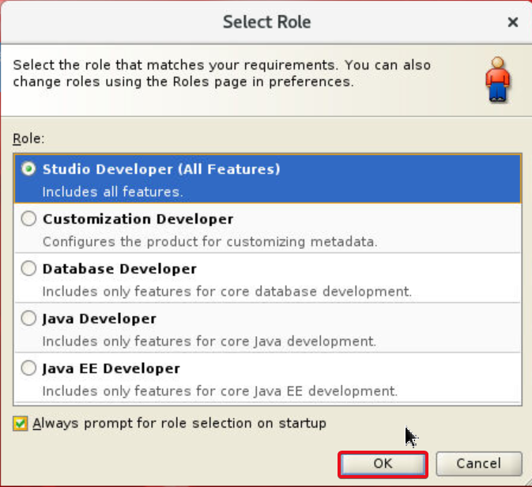

3. Click on **File** menu. Click **Import**

4. In the **Import** menu, Select **Maven Project** and Click **OK**

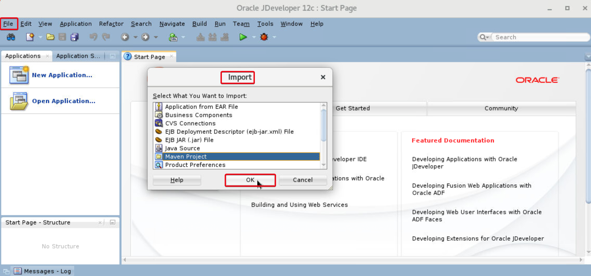

5. Use the **Search Icon** and navigate to /u01/middleware_demo/converge-java folder against the Root Directory .  Leave the **Settings File** option to default.  Select the checkbox against **pom.xml** under the **Project** options. Click **OK**

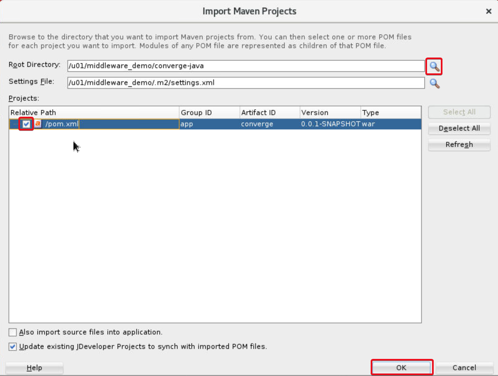

6. Provide a proper **Application Name** like eShopWebApp. Click **OK**

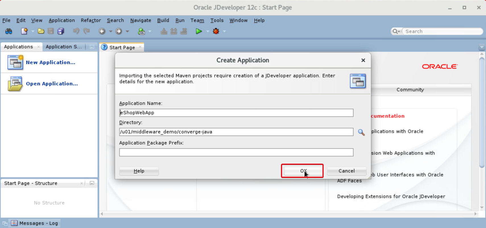

7. JDeveloper will take some time to import the application code.  Expand all **+** signs under **Converge** beneath the **Projects** tab on left hand side navigation bar to see different RESOURCES, WEB COMPONENTS and PACKAGES used in the eSHOP code

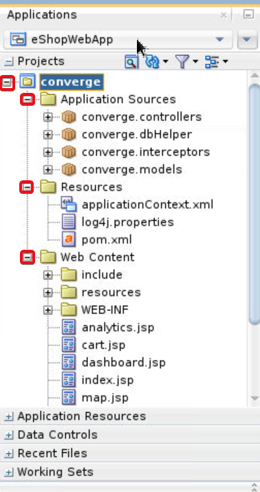

8. Expand **Resources**.  Double click on **pom.xml**.  In the Main window of the **JDeveloper**, Click on **Source**

We can see the weblogic-maven-plugin which calls the weblogic.deployer tool internally for and execution goal of *8deploy** in a Maven call.

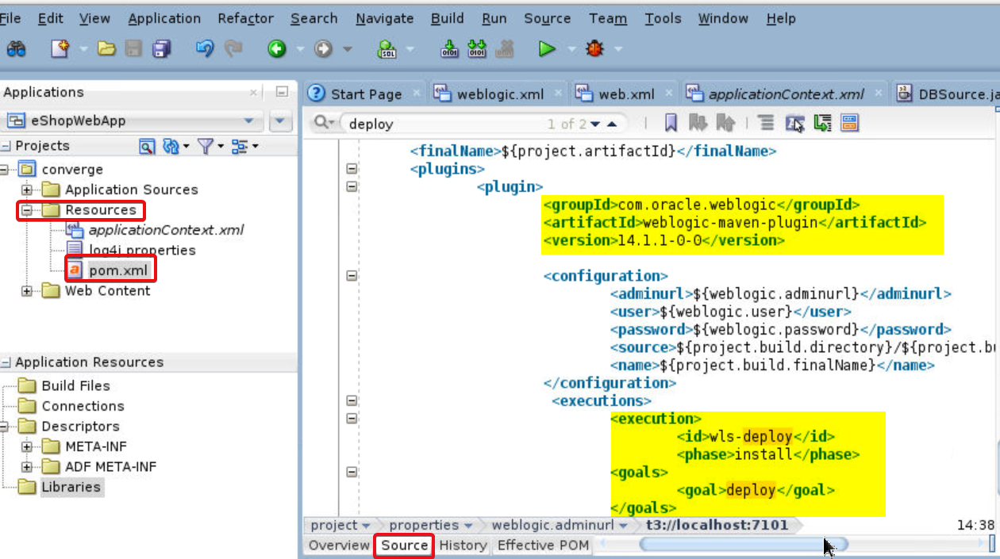

9. Under Applications Navigation Panel in JDeveloper, Under **Projects**, right click on **converge**

10. Select Run Maven, Click **Install**

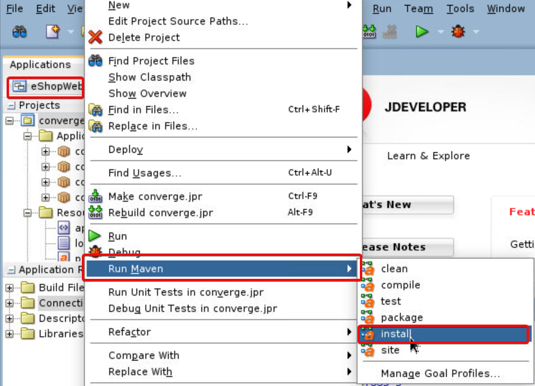

11. In the Logs section **Apache-Maven-Install-Log** observe the text **BUILD SUCCESS**.

Scroll up the log and observe that the Maven automation has created a deployable war file called converge.war under /u01/middleware_demo/converge-java/target/ folder and using the “weblogic.deployer” tool, has installed it on the configured on AdminServer of WebLogic 14 installed

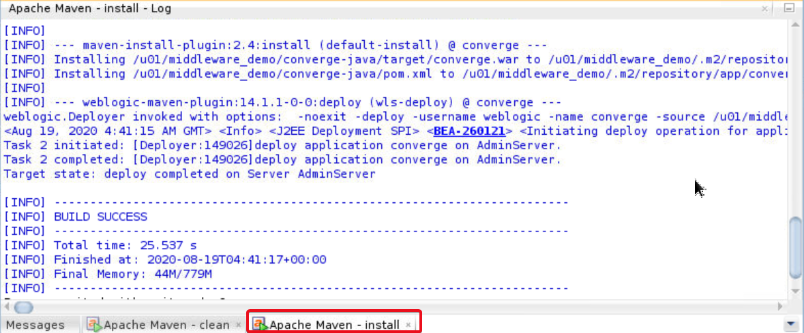

## Step 7: Verify eSHOP functionality

1. Open the Firefox browser, access the application by navigating to http://localhost:7101/  or from the bookmarks toolbar, Click **ConvergeDB-Workshop**, and Click **eSpeedShop**

2. Navigate through all endpoints and features of the application like Dashboard, shopping cart, search etc.,

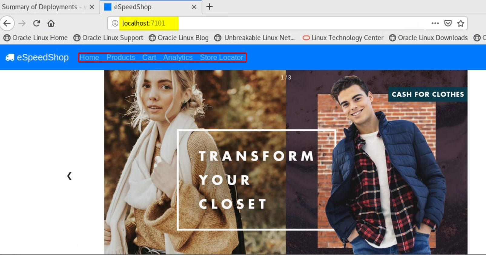


## Acknowledgements

- **Authors** - Pradeep Chandramouli,Nishanth Kaushik
- **Contributors** - Kanika Sharma,Laxmi,Balasubramanian Ramamoorthy
- **Team** - North America AppDev Specialists
- **Last Updated By** - Kay Malcolm, Director, Database Product Management, June 2021
- **Expiration Date** - June 2021


## Issues?
Please submit an issue on our [issues](https://github.com/oracle/learning-library/issues) page. We review it regularly.

      